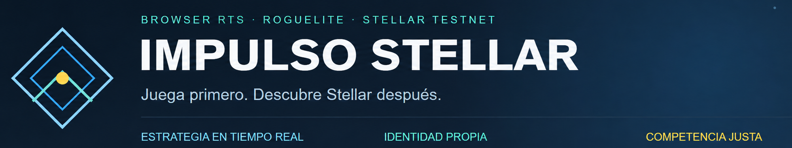
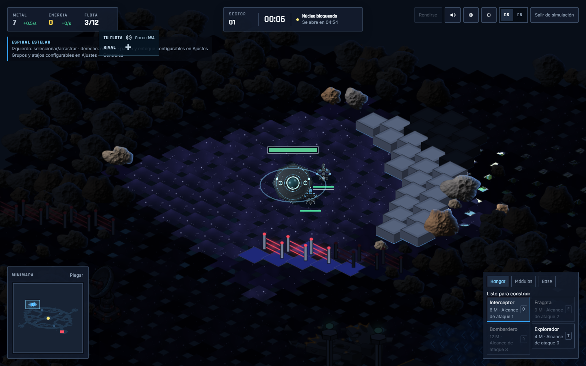
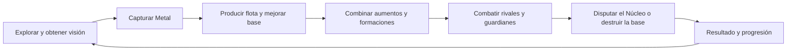
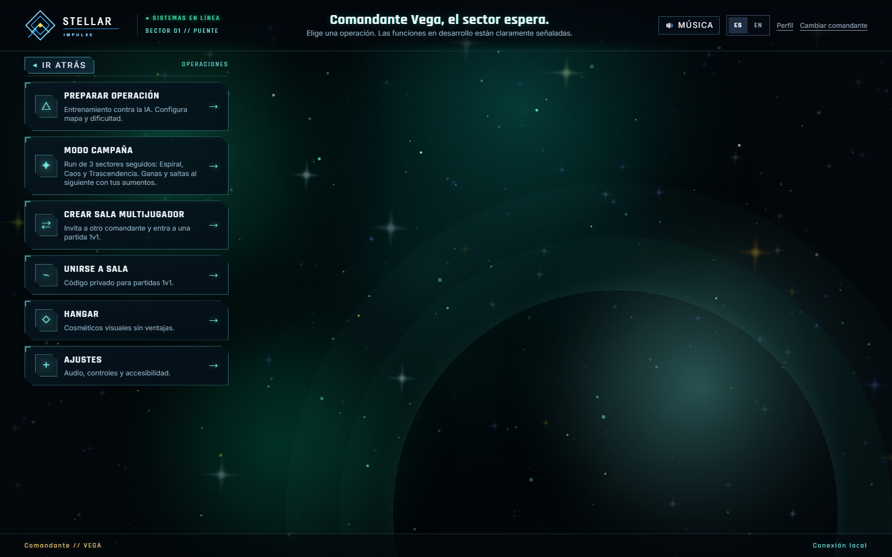
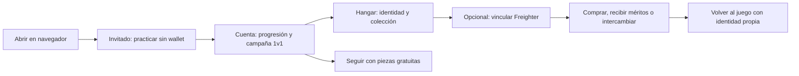
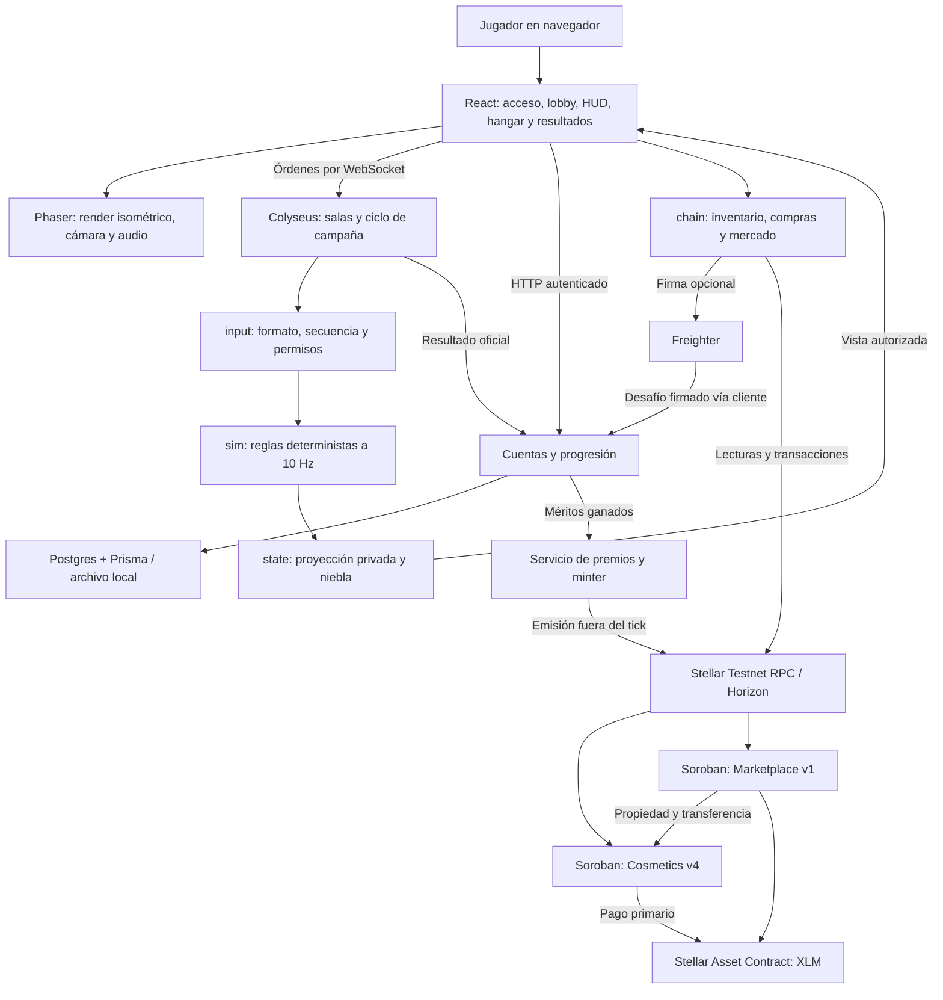
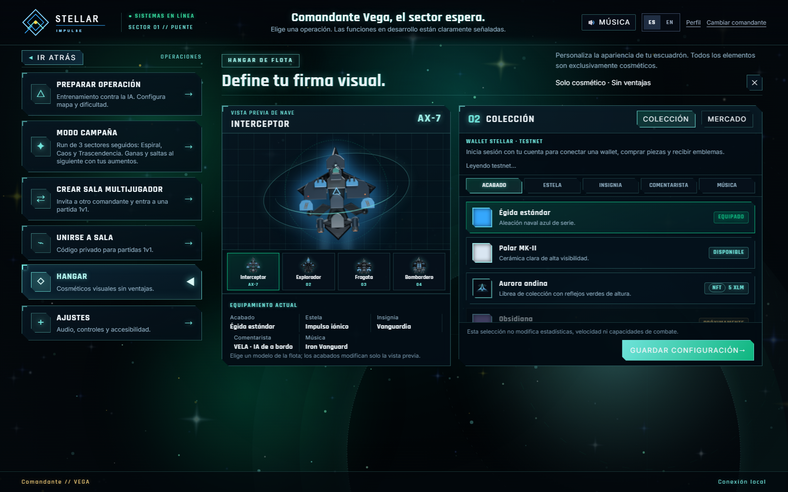
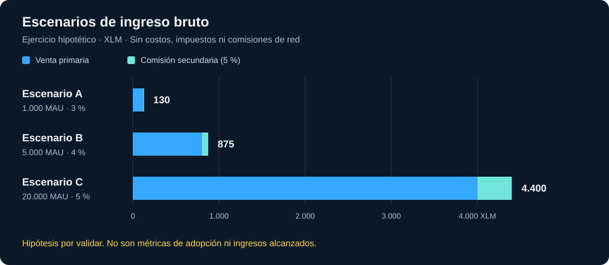
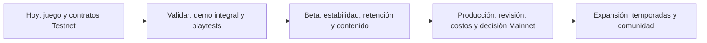

# Impulso Stellar

**Un RTS roguelite espacial para navegador que convierte la diversión en una puerta de entrada a Stellar.**

Explora bajo niebla de guerra, construye una flota, combina aumentos y disputa una campaña 1v1 de tres sectores o una run contra IA por tres mapas. Empieza sin wallet; cuando quieras personalizar tu identidad, conecta Freighter para adquirir cosméticos, conservar méritos verificables y comerciar en Stellar Testnet. **Las compras no modifican el poder de la flota.**

> Explorar para prepararse. Combatir para avanzar. Defender para ganar.

**Programa Stellar Elite Bolivia · 2026**

[**Ver video demo**](https://youtu.be/SsTC5u37snQ) · [**Ver pitch deck**](https://canva.link/h84tdah2g7uz54i) · [**Repositorio**](https://github.com/orlando-vazquez-career/stellar-impulse) · [**Contratos Testnet**](contracts/deployments/testnet.json)

**English abstract.** Stellar Impulse is a browser-based real-time strategy roguelite with server-authoritative battles, AI training and three-sector 1v1 campaigns. Players can start without a wallet. Optional Stellar integration adds cosmetic ownership, non-transferable achievement emblems and an atomic, non-custodial marketplace. Gameplay augments are earned through play; purchased NFTs never affect combat power. Two Soroban contracts have a recorded Testnet deployment; real Freighter user acceptance testing remains pending.

| Producto | Blockchain | Acceso | Etapa |
|---|---|---|---|
| RTS isométrico 2D · PvPvE · roguelite | Stellar Testnet · Soroban · XLM de prueba | Práctica como invitado; campaña con cuenta; wallet opcional | Prototipo funcional de hackathon · workspace `0.1.0` |

**Índice:** [propuesta](#1-problema-y-propuesta-de-valor) · [juego](#2-la-experiencia-de-juego) · [UX](#3-ux-jugar-primero-descubrir-la-propiedad-después) · [aporte a Stellar](#4-por-qué-stellar-y-cómo-se-beneficia-su-ecosistema) · [arquitectura](#5-arquitectura) · [tecnologías](#6-tecnologías-y-organización) · [evidencia blockchain](#7-stellar-contratos-y-evidencia-en-testnet) · [negocio](#8-modelo-de-negocio) · [roadmap](#9-a-dónde-queremos-llegar) · [ejecución](#10-ejecutar-desde-un-clon-limpio) · [demo](#11-recorrido-de-demo-para-el-jurado) · [calidad](#12-calidad-seguridad-y-límites) · [equipo](#13-equipo-documentación-y-contribuciones).

Estado documentado al **9 de octubre de 2026**. El brief v0.4 del 25 de septiembre define la visión original; el código y el registro de despliegue describen esta entrega. Algunos documentos del bootstrap conservan información histórica. Las hipótesis comerciales y las funciones futuras se identifican explícitamente.

## 1. Problema y propuesta de valor

Nuestra hipótesis de producto es que una experiencia de gaming con blockchain debe resolver dos retos a la vez: ofrecer un juego que merezca jugarse y hacer comprensible la propiedad digital. Exigir conocimiento cripto antes de la primera partida añade fricción; vender ventajas de combate debilita la confianza competitiva.

| Necesidad del jugador | Respuesta de Stellar Impulse | Evidencia |
|---|---|---|
| Probar sin preparar una wallet | Invitado y entrenamiento contra IA | [Cliente](apps/web/src/visual), [entrenamiento](apps/server/src/training-room.ts) |
| Dominar una habilidad | Combate en tiempo real, exploración, economía, counters y formaciones | [Simulación](packages/sim/src), [naves](docs/ship-stats.md) |
| Competir con reglas confiables | Órdenes validadas y vista privada por jugador | [Campaña](apps/server/src/campaign-room.ts), [proyección](packages/state/src) |
| Expresar identidad sin comprar victorias | Casco, estela, insignia, voz y música; piezas gratuitas y NFT | [Catálogo](apps/web/src/visual/hangar/catalog.ts) |
| Conservar prueba de un logro | Méritos intransferibles y emisión idempotente | [Progresión](docs/progression.md), [premios](apps/server/src/chain-rewards.ts) |
| Intercambiar una colección | Mercado sin custodia y comisión visible | [Contrato](contracts/marketplace/src/lib.rs) |

### Más allá de una colección de cartas

Las cartas son **aumentos de una partida de estrategia en tiempo real**: modifican decisiones sobre una flota que se mueve, combate y captura objetivos en un mundo isométrico. No son los NFT vendidos en el hangar. La progresión desbloquea opciones mediante XP y desafíos; comprar cosméticos no desbloquea daño, recursos ni mejores estadísticas.

La innovación que queremos validar está en la combinación de entrada gradual, profundidad táctica, continuidad entre sectores, identidad audiovisual y propiedad verificable. El jugador encuentra una experiencia funcional antes de tener que entender una transacción.

## 2. La experiencia de juego



*Captura local del cliente conectado al servidor de entrenamiento; no certifica una operación con wallet.*



| Sistema | Cómo se juega | Qué aporta |
|---|---|---|
| Exploración y niebla | Descubrir terreno, recordar zonas exploradas y ver enemigos únicamente cuando son visibles | Información como recurso táctico |
| Economía | Capturar Metal, producir naves, administrar módulos y mejoras | Elegir entre expansión, defensa y ataque |
| Composición | Interceptor vence a Bombardero; Fragata a Interceptor; Bombardero a Fragata. El Explorador aporta visión y no captura | Counters y flotas mixtas |
| Control | Selección individual/múltiple, órdenes, formaciones, cámara y minimapa | Experiencia de RTS en navegador |
| Aumentos roguelite | Elegir ofertas y conservar aumentos entre sectores de campaña | Variación con continuidad |
| Victoria | Control del Núcleo, destrucción de base o rendición según el modo | Distintas maneras de cerrar una partida |
| Progresión | XP, desafíos, mejores marcas y desbloqueos calculados por el servidor | Motivos para aprender y volver |

### Modos disponibles

- **Práctica contra IA:** admite invitados; dificultad Fácil, Media o Difícil y duración Escaramuza o Partida completa. Incluye tutorial para seleccionar, mover, producir, capturar Metal y construir la Refinería.
- **Run contra IA — «Modo campaña»:** recorrido por Espiral Estelar, Caos Estelar y Trascendencia Estelar. Ganar permite saltar al siguiente mapa conservando aumentos; perder reinicia la run. Incluye transiciones de salto, resumen de sectores y pantalla final. [Estado de la run](apps/web/src/visual/run/run-state.ts), [orquestación](apps/web/src/visual/run/RunScreen.tsx).
- **Campaña privada 1v1:** dos cuentas distintas crean o se unen a una sala por código y confirman que están listas. Cada uno de sus tres sectores reinicia economía, flota, base y nodos; conserva y reaplica aumentos. Las elecciones progresan por plata, oro y prismático. Ganar el sector final decide la campaña: no es una serie al mejor de tres.
- **Vista previa del mapa:** la preparación de la práctica y la sala multijugador muestran un esquema del mapa elegido, con bases, Núcleo y objetivos.

La campaña **multijugador** actual reutiliza **Espiral Estelar en los tres sectores**; la run contra IA recorre tres mapas distintos. La reserva de reconexión de la campaña multijugador dura hasta 60 segundos, con hasta dos pausas por jugador. Una recarga puede recuperar el asiento mientras la reserva siga vigente. La run se orquesta en memoria del cliente y no ofrece esa recuperación entre mapas. No existe todavía un bot que sustituya a un jugador desconectado.

El objetivo de diseño del brief es una campaña de **20–25 minutos**; su duración y balance deben validarse con playtests. El código actual incluye límites de seguridad distintos del cronograma original. Las bases pueden destruirse después de su escudo inicial, una evolución respecto de las bases invulnerables del brief.

### Evolución respecto del brief v0.4

| Diseño del 25 de septiembre | Entrega actual |
|---|---|
| IA fuera de la demo inicial | Práctica con dificultades y run contra IA |
| Base siempre invulnerable | Base destructible tras escudo inicial |
| Cuatro cosméticos y tres ranuras | Seis clases en Testnet y cinco categorías, incluidas voz y música |
| Mercado como ampliación posterior | Contrato de mercado separado, con despliegue registrado |
| PostgreSQL después de la demo | Store Prisma/Postgres y migraciones implementados |
| Metal y Energía previstos | Metal operativo; Energía pendiente |

Detalles: [protocolo](docs/protocol.md), [aumentos](docs/augments.md), [bases](docs/base-system.md), [progresión](docs/progression.md) y [tutorial](docs/first-practice-tutorial.md).

## 3. UX: jugar primero, descubrir la propiedad después





| Decisión de UX | Implementación actual | Próxima validación |
|---|---|---|
| Wallet opcional | Entrenamiento y campaña sin wallet; opción gratuita en cada categoría del hangar | Finalización de primera práctica |
| Aprender jugando | Tutorial sobre el HUD, sin pausar ni dar órdenes por el jugador | Comprensión y abandono por paso |
| Identidad audiovisual | Casco, estela, insignia, voz y música | Equipamiento y compra con Freighter real |
| Feedback comprensible | Estados de conexión, órdenes rechazadas y errores de red/wallet/saldo | Recuperación ante rechazo y fallos |
| Continuidad | Progresión con cuenta y recuperación de asiento | Recarga, reconexión y guardado públicos |
| Preferencias | ES/EN, controles, mezcla de audio y opciones visuales de accesibilidad | Usabilidad con jugadores y equipos objetivo |

Queremos que la primera interacción significativa sea **dar una orden a la flota**. La firma aparece cuando el jugador elige una función de propiedad digital. La conexión actual requiere la extensión Freighter; passkeys, wallet embebida y patrocinio de comisiones son posibilidades futuras.

## 4. Por qué Stellar y cómo se beneficia su ecosistema

Stellar aporta una red compartida para cuentas, activos y contratos. Soroban permite escribir la lógica de propiedad y mercado en Rust y desplegarla como WebAssembly. Usamos XLM nativo mediante Stellar Asset Contract y desafíos de firma basados en SEP-10 para demostrar control de una wallet. Referencias oficiales: [Soroban](https://developers.stellar.org/docs/build/smart-contracts/overview), [Stellar Asset Contract](https://developers.stellar.org/docs/tokens/stellar-asset-contract) y [SEP-10](https://github.com/stellar/stellar-protocol/blob/master/ecosystem/sep-0010.md).

La elección se concreta en **dos contratos, un cliente compartido, firma con Freighter y premios emitidos desde el servidor**. No se requiere un token propio del juego para participar o personalizarse.

| Aporte esperado a Stellar | Mecanismo | Indicador propuesto |
|---|---|---|
| Acercar jugadores nuevos a blockchain | Disfrutar una partida y descubrir una wallet en el hangar | Jugadores que vinculan su primera wallet |
| Crear utilidad para Soroban | Comprar, consultar y transferir cosméticos dentro de una experiencia jugable | Wallets activas y operaciones confirmadas por usuario |
| Hacer comprensible la propiedad | Separar piezas coleccionables de emblemas de mérito | Comprensión y reclamación de méritos |
| Actividad económica voluntaria | Ventas primarias y mercado atómico | Volumen legítimo, compradores únicos y recurrencia |
| Código reutilizable | Contratos, firma, inventario, premios y pruebas en un monorepo público | Contribuciones y reutilización por otros equipos |

**Son resultados por medir, no cifras de adopción alcanzadas.** No presentamos usuarios activos, retención ni ingresos de producción. Buscamos crecimiento por partidas disfrutadas y usuarios que regresan; evaluaremos las transacciones junto a su utilidad, éxito y costo.

El tick del servidor no espera confirmaciones de blockchain. Una caída del RPC puede impedir una compra o emisión; la simulación de combate permanece independiente. Así Stellar puede aportar propiedad y comercio sin imponer su latencia al control de la flota.

## 5. Arquitectura



### Principios del sistema

1. **El servidor decide.** El navegador solicita acciones; no declara daño, victoria, XP ni propiedad de unidades. Las órdenes se validan antes de aplicarlas.
2. **La vista es privada.** Cada jugador recibe una proyección compatible con su visión; los enemigos ocultos no se envían como posiciones actuales.
3. **La simulación es pura.** `packages/sim` depende únicamente de `packages/input`; no importa red, render, wallet ni inventario. [El verificador](scripts/check-boundaries.mjs) bloquea dependencias indebidas y fuentes de tiempo/azar no controladas.
4. **Los cosméticos quedan fuera del balance.** Las reglas de combate no consumen compras ni inventario NFT.
5. **La firma autoriza acciones concretas.** El jugador firma compras y mercado; el minter del servidor firma premios. Las claves privadas no se envían al cliente.
6. **Los premios toleran reintentos.** Un identificador por cuenta, mérito y contrato impide una segunda emisión del mismo logro.

**Configuración de despliegue:** cliente estático en Vercel, proceso Node/Colyseus en Railway, cuentas/logros en Postgres y propiedad/pagos en Stellar Testnet. El servidor usa una réplica; salas y sesiones viven en memoria. Reiniciar termina partidas y exige login. No se declara escalabilidad horizontal certificada. Véase [despliegue](docs/deployment.md).

### Compraventa sin custodia

```mermaid
sequenceDiagram
    participant S as Vendedor / Freighter
    participant M as Marketplace Soroban
    participant N as Cosmetics Soroban
    participant B as Comprador / Freighter
    participant X as Token XLM
    S->>M: Firmar list(token, precio, vencimiento)
    M->>N: Verificar propietario y autorizar mercado
    Note over S,N: La pieza sigue en la wallet del vendedor
    B->>M: Firmar buy(listing)
    M->>N: Verificar propiedad y autorización vigentes
    M->>X: Pagar 95 % al vendedor y 5 % a tesorería
    M->>N: Transferir pieza al comprador
    Note over M,X: Una sola transacción: un fallo revierte la venta
    M-->>B: Venta confirmada; actualizar inventario
```

## 6. Tecnologías y organización

Versiones tomadas de los manifiestos del proyecto; describen esta entrega, no las últimas versiones disponibles.

| Capa | Tecnología | Versión declarada | Función |
|---|---|---|---|
| Lenguaje | TypeScript | `5.9.3` | Reglas, mensajes, servidor y cliente tipados |
| Interfaz | React | `19.3.0` | Pantallas, HUD y preferencias |
| Render | Phaser | `4.2.1` | Escena isométrica y representación del combate |
| Herramientas web | Vite | `8.3.0` | Desarrollo y bundle web |
| Runtime / workspace | Node.js / pnpm | `24.19.0` / `11.25.0` | Scripts, servidor y monorepo |
| Multijugador | Colyseus Core / SDK | `0.18.15` / `0.18.3` | Salas, WebSocket y reconexión |
| Persistencia | PostgreSQL + Prisma | Prisma `7.10.0` | Cuentas, XP, logros, resultados y wallet |
| Stellar | Stellar SDK / Freighter API | `17.1.0` / `6.0.1` | RPC, XDR, firma, inventario y pagos |
| Contratos | Rust / Soroban SDK / Stellar CLI | `1.98.1` / `28.0.0` / `28.0.0` | Propiedad y mercado compilados a WASM |
| Mapas | Tiled + parser propio | TMJ/TMX y atlas | Terreno, bloqueos, rampas y rutas |
| Tests | Vitest / Playwright | `5.0.1` / `1.63.0` | Unitarias, integración y navegador |
| CI | GitHub Actions | [Workflow](.github/workflows/ci.yml) | Calidad en tres SO, navegador, Postgres y contratos |

```text
stellar-impulse/
├── apps/
│   ├── web/                  # React, Phaser, lobby, HUD y hangar
│   └── server/               # Colyseus, cuentas, progresión y Prisma
├── packages/
│   ├── input/                # Mensajes y órdenes serializables
│   ├── sim/                  # Reglas puras, combate, IA, mapas y aumentos
│   ├── state/                # Vista autorizada por jugador
│   └── chain/                # Wallet, NFT, mercado y transacciones
├── contracts/
│   ├── cosmetics/            # Propiedad, compra y premios
│   ├── marketplace/          # Listar, cancelar y liquidar ventas
│   └── deployments/          # Evidencia pública de Testnet
├── tests/e2e/                # Recorridos de navegador
├── scripts/                  # Calidad, sonda y herramientas de contratos
└── docs/                     # Diseño, producto, QA y operación
```

## 7. Stellar: contratos y evidencia en Testnet



*Captura como invitado: explorar la personalización no exige conectar una wallet.*

### Despliegue registrado

[testnet.json](contracts/deployments/testnet.json) registra contratos, transacciones, hashes WASM, roles, catálogo y prueba de humo. Timestamp: `2026-10-09T03:22:16.970Z`, equivalente al **8 de octubre, 23:22, en Bolivia (UTC−4)**. Es evidencia de la ejecución registrada; la disponibilidad actual debe comprobarse en red, especialmente tras reinicios de Testnet.

| Contrato | Versión | Dirección y explorador |
|---|---|---|
| Cosmetics | `4` | [`CBKQMFOSP2RFRXL6KQH3VTLVOKJCUU6K3XJLRNEUJHJJM7AZT2JSLA6L`](https://stellar.expert/explorer/testnet/contract/CBKQMFOSP2RFRXL6KQH3VTLVOKJCUU6K3XJLRNEUJHJJM7AZT2JSLA6L) |
| Marketplace | `1` | [`CDB77C2EVQFHI6DNOK7Q7FZNJ6OMRRONMS5EI5BLIKV3UMENYE7NQ53C`](https://stellar.expert/explorer/testnet/contract/CDB77C2EVQFHI6DNOK7Q7FZNJ6OMRRONMS5EI5BLIKV3UMENYE7NQ53C) |

Transacciones de despliegue: [Cosmetics](https://stellar.expert/explorer/testnet/tx/afcf66e21b1338c86c2f7191b12d6e82f33c7609f6660171b52c8728c6bf02c3) · [Marketplace](https://stellar.expert/explorer/testnet/tx/81242bddac5b39bad3a355a633564d138e4caa142b81b79c4c1418936c653c72).

| Evidencia del registro | Resultado |
|---|---|
| Compra primaria | Se obtuvo el token `1` |
| Premio | Se emitió el token `2`; duplicar el mismo premio fue rechazado |
| Inventario | Tokens `2` y `1`; clase `2` presente |
| Venta secundaria | Listing `1`, precio **2 XLM de prueba**, comisión **0,1 XLM** |
| Transferencia | La cuenta compradora figura como nueva propietaria |

Los XLM de **Testnet no constituyen ingresos reales**. El cambio de saldo del vendedor incluye costos de red; el reparto económico del contrato es 95/5 antes de esos costos.

### Catálogo registrado

| Clase | Pieza | Categoría | Obtención | Transferible |
|---|---|---|---|---|
| `1` | Aurora Andina | Casco / librea | **5 XLM de prueba** | Sí |
| `2` | Pulso Violeta | Estela | **3 XLM de prueba** | Sí |
| `3` | Primera Victoria | Insignia de mérito | Ganar una campaña 1v1 válida | No |
| `4` | Exploración | Insignia de mérito | Completar una campaña 1v1 válida | No |
| `5` | Voz de Analista | Voz | **4 XLM de prueba** | Sí |
| `6` | Gravity's Final Path | Música | **2 XLM de prueba** | Sí |

Importes enteros: **1 XLM = 10.000.000 stroops**. El contrato distingue colección, mérito y veteranía; el catálogo desplegado usa colección y mérito. Comprar el cosmético musical no transfiere derechos de autor sobre la grabación.

### Garantías y alcance

- **Cosmetics:** clases, inventario, compra primaria, transferencia, aprobaciones, premios idempotentes y roles separados `admin`, `minter`, `treasury`. Rotación de roles en dos pasos. Los méritos no se venden ni transfieren.
- **Marketplace:** publicar, cancelar y comprar sin depositar la pieza en el mercado. Comisión configurada: **500 puntos básicos = 5 %**; máximo admitido por contrato: 10 %. Anuncios con vencimiento y lecturas paginadas.
- **Vinculación de wallet:** desafío basado en SEP-10, comprobado por cliente y servidor; cinco minutos de vigencia, uso único y vínculo a la cuenta solicitante. Prueba control de la dirección sin mover fondos. No declara implementación completa de todos los endpoints y mecanismos de descubrimiento SEP-10.
- **Méritos anteriores a la wallet:** se revisan al vincularla y al terminar campañas. La emisión requiere minter autorizado, configurado y fondeado en el backend.
- **Persistencia en cadena:** los contratos extienden TTL; producción requiere mantenimiento/restauración y revisión de costos. No se promete disponibilidad perpetua de piezas o metadatos.

**La aceptación integral con Freighter real sigue pendiente.** Una venta registrada en red y los tests no sustituyen esa prueba de experiencia. Detalles: [mercado y wallet](docs/blockchain-marketplace.md).

## 8. Modelo de negocio

**Free-to-play con personalización cosmética y comisión de mercado.** Las operaciones económicas existen en Testnet; aún no se han validado demanda, disposición a pagar ni rentabilidad.

### Canvas de negocio

| Elemento | Propuesta |
|---|---|
| Segmentos | Jugadores de estrategia en navegador y comunidades competitivas; usuarios Stellar interesados en experiencias jugables |
| Valor | Acceso sin wallet, profundidad táctica, identidad audiovisual, méritos verificables y colección transferible sin comprar poder |
| Canales por validar | Comunidades RTS/indie, demo de hackathon, creadores de contenido y comunidades Stellar |
| Relación | Tutorial, práctica, progresión, partidas entre conocidos, feedback y futuras temporadas |
| Ingresos | Venta primaria y 5 % sobre ventas secundarias; nuevas colecciones sujetas a validación |
| Recursos | Simulación, UX, arte/audio, backend, contratos y comunidad |
| Actividades | Balance, contenido, operación de salas, QA, seguridad, playtests y análisis de retención |
| Aliados potenciales | Artistas, comunidades y proveedores del ecosistema Stellar; no implica acuerdos existentes |
| Costos | Hosting, Postgres, observabilidad, contenido con derechos, QA, contratos y seguridad |

| Fuente | Valor para el jugador | Estado | Condición para avanzar |
|---|---|---|---|
| Venta primaria | Expresar identidad con casco, estela, voz y música | Contrato y catálogo Testnet | Prueba completa y disposición a pagar |
| Mercado secundario | Intercambiar piezas coleccionables | Contrato Testnet; 5 % | Freighter, costos y liquidez real |
| Colecciones de temporada | Contenido con tema y procedencia | Hipótesis futura | Retención y capacidad creativa |
| Colaboraciones | Colecciones de artistas/comunidades | Hipótesis futura | Derechos acordados e interés validado |
| Méritos | Reconocimiento del desempeño | Premios implementados | Se ganan jugando; **no se venden** |

### Escenarios económicos ilustrativos

Ejercicio para explicar variables, **no proyección financiera ni meta comprometida**. MAU = usuarios activos mensuales. Suponemos una compra mensual de **4 XLM por comprador** y omitimos costos, impuestos, reembolsos y comisiones de red.

| Hipótesis | MAU | Conversión | Compradores | Venta primaria | Volumen secundario | Comisión 5 % | Ingreso bruto |
|---|---:|---:|---:|---:|---:|---:|---:|
| A | 1.000 | 3 % | 30 | 120 XLM | 200 XLM | 10 XLM | **130 XLM** |
| B | 5.000 | 4 % | 200 | 800 XLM | 1.500 XLM | 75 XLM | **875 XLM** |
| C | 20.000 | 5 % | 1.000 | 4.000 XLM | 8.000 XLM | 400 XLM | **4.400 XLM** |



```text
Ingreso bruto = (MAU × conversión × compras por comprador × precio medio)
                + (volumen secundario × 0,05)

Resultado operativo = ingreso reconocido − infraestructura − contenido
                      − operación − costos de red asumidos − otros costos
```

El volumen del mercado **no** es ingreso del proyecto: solo la comisión lo es. Evaluar rentabilidad exige moneda contable, costos medidos y supuestos de conversión. No ofrecemos rendimiento financiero, apreciación, recompensas monetarias por jugar ni cajas de botín.

### Métricas para validar

| Pregunta | Métrica propuesta | Cálculo |
|---|---|---|
| ¿La entrada es sencilla? | Activación | Nuevos usuarios que llegan a práctica jugable / nuevos usuarios |
| ¿El tutorial enseña? | Finalización | Usuarios que terminan / usuarios que lo inician |
| ¿El juego merece volver? | Retención D1/D7 | Cohorte que vuelve al día 1 o 7 / cohorte inicial |
| ¿La campaña funciona? | Finalización y abandono | Campañas terminadas o abandonadas / iniciadas |
| ¿Interesa la propiedad? | Adopción de wallet | Cuentas activas con wallet / cuentas activas |
| ¿La economía es usable? | Éxito transaccional | Operaciones confirmadas / intentos de compra o venta |
| ¿Existe disposición a pagar? | Conversión y recurrencia | Compradores únicos / cuentas activas; compradores que repiten |
| ¿Es sostenible operar? | Costo por partida/usuario | Costos atribuibles / partidas finalizadas o MAU |

La instrumentación de estas métricas aún debe implementarse o consolidarse. La progresión actual no equivale a un sistema completo de analítica de producto.

## 9. A dónde queremos llegar

**Visión:** una experiencia competitiva de estrategia espacial que crezca por temporadas y comunidad, con Stellar como capa de propiedad y comercio que el jugador elige usar.



| Etapa | Entregable | Criterio de salida |
|---|---|---|
| **Hoy: prototipo** | Práctica, campaña, progresión, hangar y dos contratos registrados | Código revisable, ejecución local y evidencias |
| **Demo validada** | Dos jugadores/wallets; compra, equipamiento, venta, cancelación y mérito | [Playtest](docs/qa/playtest-2026-10-09.md) completo con resultados reales |
| **Beta jugable** | Balance, métricas, resiliencia y cosméticos visibles entre rivales | Playtests repetibles, monitoreo y reducción de fallos críticos |
| **Más contenido** | Ampliar mapas en 1v1, cosméticos y economía táctica | Balance medido; Energía sigue pendiente |
| **Producción** | Revisión independiente, secretos, metadatos, TTL, costos y recuperación | Riesgos críticos cerrados y decisión explícita antes de Mainnet |
| **Expansión** | Temporadas, alianzas creativas; evaluar 2v2, móvil y acceso alternativo | Demanda y viabilidad demostradas; sin fecha comprometida |

El brief v0.4 fijó **7 de octubre** para la demo y **11 de octubre de 2026** para la entrega formal. Son hitos del plan original, no certificaciones de aceptación. El roadmap posterior depende de evidencia; no asignamos fechas artificiales a funciones por validar.

## 10. Ejecutar desde un clon limpio

### Requisitos

- Git, **Node.js `24.19.0`** y **pnpm `11.25.0`**.
- Navegador de escritorio; viewport recomendado de al menos **1024 px**. No se certifica todavía experiencia táctil móvil.
- Postgres opcional: sin `DATABASE_URL`, las cuentas se guardan en archivo.
- Freighter solo para wallet; Rust/Stellar CLI solo para contratos.

```sh
git clone https://github.com/orlando-vazquez-career/stellar-impulse.git
cd stellar-impulse
npm install --global pnpm@11.25.0
pnpm install --frozen-lockfile
pnpm dev
```

| Servicio | Dirección local |
|---|---|
| Cliente | [http://127.0.0.1:5173](http://127.0.0.1:5173) |
| Health | [http://127.0.0.1:2567/health](http://127.0.0.1:2567/health) |

La configuración predeterminada permite iniciar sin copiar `.env`. `/visual` abre la misma interfaz que `/`.

### Primera partida

1. Escribe un alias y pulsa **Continuar como invitado**.
2. Elige **Preparar operación**, configura práctica y marca **Estoy listo para desplegar**.
3. Pulsa **Iniciar operación**, elige un aumento y sigue el tutorial.
4. Explora, captura Metal, produce una flota y disputa el objetivo.

Controles: **WASD** cámara; **clic izquierdo** selección; **arrastre** selección múltiple; **clic derecho** órdenes; **Q** ataque. Se pueden configurar en ajustes.

### Campaña con otra persona

1. Crea dos cuentas distintas en dos navegadores/perfiles.
2. La primera elige **Crear sala multijugador → Crear sala** y comparte el código.
3. La segunda elige **Unirse a sala** e introduce el código.
4. Ambas pulsan **Estoy listo** y eligen el aumento inicial tras la cuenta regresiva.
5. Juegan los tres sectores; el tercero decide la campaña. No necesitan wallet.

### Configuración opcional

| Variable | Ámbito | Uso |
|---|---|---|
| `VITE_SERVER_URL` | Cliente; pública en bundle | URL HTTP/HTTPS del backend |
| `HOST`, `PORT` | Servidor | Dirección y puerto |
| `WEB_ORIGIN` | Servidor | Origen exacto del frontend |
| `AUTH_DATA_FILE` | Servidor | Archivo local de cuentas/progreso |
| `DATABASE_URL` | Servidor; privada | Persistencia Postgres |
| `STELLAR_MINTER_SECRET` | Solo servidor; privada | Firmar premios con el minter autorizado |
| `COSMETICS_CONTRACT_ID` | Servidor | Contrato del servicio de premios |

El cliente permite `apps/web/.env.local`: [ejemplo](apps/web/.env.example). Las variables del servidor se suministran en el entorno; [su ejemplo](apps/server/.env.example) **no se carga automáticamente**. Nunca coloques secretos en `VITE_`.

Con Postgres, `pnpm --filter @impulso/server start` aplica migraciones antes de arrancar. `dev` no realiza ese paso; consulta [desarrollo](docs/development.md) antes de usar una base nueva. Sin minter, el juego continúa sin emitir méritos en cadena.

## 11. Recorrido de demo para el jurado

| Paso | Acción | Qué demuestra |
|---|---|---|
| 1 | Entrar como invitado sin extensión | Acceso independiente de blockchain |
| 2 | Elegir aumento, mover y producir una nave | Gameplay, tutorial y decisiones |
| 3 | Mostrar niebla, nodos y composición | Profundidad más allá de coleccionar cartas |
| 4 | Campaña con dos cuentas y una recarga | Autoridad, lobby y recuperación |
| 5 | Hangar y vínculo de Freighter Testnet | Identidad y consentimiento de firma |
| 6 | Comprar, publicar y vender entre wallets; abrir explorador | Propiedad y liquidación verificables |
| 7 | Completar campaña y comprobar mérito | Reconocimiento de resultado oficial |

Los pasos con wallet requieren **Freighter en Testnet**, fondos de Friendbot y minter en backend para premios. Usa las direcciones registradas; una demo de usuario no requiere redesplegar. Los pasos 5–7 deben ensayarse antes de presentarlos como validados: [guía](docs/blockchain-marketplace.md). El [video](https://youtu.be/SsTC5u37snQ) y [pitch deck](https://canva.link/h84tdah2g7uz54i) fueron proporcionados por el equipo como materiales de presentación.

## 12. Calidad, seguridad y límites

```sh
pnpm check
pnpm exec playwright install chromium
pnpm test:e2e
pnpm chain:probe
pnpm contracts:fmt
pnpm contracts:test
pnpm contracts:check
pnpm contracts:build
```

| Comando / verificación | Alcance |
|---|---|
| `pnpm check` | Límites de simulación, higiene pública, tipos, unitarias/integración y build |
| `pnpm test:e2e` | Navegador: acceso, tutorial, combate, progresión y campaña |
| `pnpm chain:probe` | Salud e identidad Testnet; lectura, no compra ni despliegue |
| `pnpm contracts:test` | Lógica, autorización y errores en host Soroban |
| `pnpm contracts:fmt/check/build` | Formato, compilación Rust y WASM |
| Job de base de datos en CI | Store/migraciones contra Postgres real |

**Verificación local para este README:** `pnpm check` pasó con Node `24.19.0` y pnpm `11.25.0`: **913 tests aprobados, 10 omitidos, 127 archivos aprobados y 2 omitidos**, tipos y build correctos. Los omitidos corresponden a Postgres sin `DATABASE_URL_TEST` y pruebas de apagado que se omiten en Windows; no se cuentan como aprobados. Esta ejecución no valida Postgres real, firmas humanas, disponibilidad de contratos ni el estado remoto de CI.

También se recorrió el cliente local con Chromium: entrada como invitado, hangar, práctica conectada al servidor, elección de aumento y producción de una nave. Las tres capturas provienen de ese recorrido. Se verificaron rutas de imágenes, enlaces locales, anclas, direcciones de contratos y aritmética de la gráfica. Esto no sustituye la suite E2E completa ni el playtest manual.

La [entrega anterior de blockchain](docs/blockchain-marketplace.md) registra **35 tests Rust**: 20 de cosméticos y 15 de mercado. Ese resultado es histórico; consulta [GitHub Actions](https://github.com/orlando-vazquez-career/stellar-impulse/actions) para el commit evaluado. Requisitos de tests adicionales: [testing](docs/testing.md).

En Windows, contratos usan **WSL2**; Linux/macOS usan toolchain nativo. Versiones: Rust `1.98.1`, Soroban SDK `28.0.0`, Stellar CLI `28.0.0`, target `wasm32v1-none`. [Preparación](docs/blockchain.md#entorno-reproducible).

### Estado verificable

| Área | Estado | Límite relevante |
|---|---|---|
| Práctica y RTS | Implementados | Balance/desempeño por validar en equipos objetivo |
| Run contra IA | Tres mapas, aumentos y transiciones | Orquestación en memoria del cliente; recorrido completo por validar |
| Campaña 1v1 | Implementada | Tres sectores sobre el mismo mapa; salas efímeras |
| Cuenta/progresión | Archivo o Postgres | Sesiones en memoria; reiniciar exige login |
| Hangar | Equipamiento y catálogo implementados | El rival aún no ve la librea de la otra persona |
| Contratos/mercado | Implementados; despliegue Testnet registrado | Sin auditoría para fondos reales; vigencia por comprobar |
| Wallet | Flujos y tests implementados | Freighter manual pendiente |
| Méritos en cadena | Servicio e idempotencia implementados | Wallet y minter configurado/fondeado |
| Energía/bot de reemplazo | Planificados | No disponibles |
| Mainnet/móvil/2v2 | Visión futura | No publicados ni comprometidos |

La blockchain verifica propiedad, permisos y operaciones económicas; **los resultados dependen del servidor autoritativo**. No declaramos combate completamente descentralizado ni prueba criptográfica de cada resultado.

Controles presentes: hashes de contraseña con salt, límite de verificaciones de acceso, validación de origen/mensajes, secuencias, vistas privadas, expiración de desafíos, roles e idempotencia. Antes de producción: revisión independiente, abuso/carga, secretos, metadatos, TTL y recuperación. Reportes privados según [SECURITY.md](SECURITY.md); el [modelo de amenazas y políticas](docs/security/SECURITY.md) detalla controles y pendientes al 10 de octubre de 2026.

## 13. Equipo, documentación y contribuciones

| Integrante | Área |
|---|---|
| Hans | Coordinación, calidad, demo y pitch |
| Diego | Reglas, balance y diseño |
| Yamil | Juego, simulación y pruebas integrales |
| Orlando Vázquez | Backend, multijugador y Stellar |
| Ismael | Arte, interfaz y dirección visual |

### Documentación

| Recurso | Contenido |
|---|---|
| [Índice](docs/README.md) | Navegación de documentos |
| [Informe ejecutivo](docs/INFORME_EJECUTIVO.md) | Síntesis de producto, negocio, evidencia y riesgos |
| [Modelo de negocio](docs/business/BUSINESS_MODEL.md) / [plan de negocio](docs/business/BUSINESS_PLAN.md) | Valor, monetización, operación y presupuesto |
| [Go-to-market](docs/business/GO_TO_MARKET.md) / [roadmap](docs/business/ROADMAP.md) | Adquisición, KPIs y hitos Q1–Q3 2027 |
| [Finanzas](docs/business/TOKENOMICS_FINANCE.md) / [informe de activos](docs/business/ASSET_REPORT.md) | Escenarios económicos, catálogo, procedencia y derechos |
| [Seguridad](docs/security/SECURITY.md) / [preparación de cumplimiento](docs/security/COMPLIANCE.md) | Amenazas, políticas, auditoría y requisitos de comercialización |
| [Arquitectura actual](docs/architecture/ARCHITECTURE.md) / [contratos y flujos](docs/architecture/CONTRACTS_AND_DATA_FLOW.md) | Implementación y límites de la entrega |
| [Arquitectura](docs/architecture.md) / [protocolo](docs/protocol.md) | Capas, mensajes y autoridad |
| [Mercado](docs/blockchain-marketplace.md) | Integración y recorrido Freighter |
| [Registro Testnet](contracts/deployments/testnet.json) | Direcciones, transacciones, hashes y smoke |
| [Diseño](DESIGN.md) / [marca](docs/brand-manual.md) | Visión y lenguaje visual |
| [Despliegue](docs/deployment.md) / [testing](docs/testing.md) | Operación y validación |
| [QA manual](docs/qa/playtest-2026-10-09.md) | Casos por ejecutar y resultados |
| [Contribuir](CONTRIBUTING.md) | Flujo de colaboración |

### Créditos y licencias

Gracias a **Blockchain Acceleration Foundation (BAF)** y a **Stellar Development Foundation** por los espacios de formación y conexión del programa Stellar Elite. Esta participación no implica aval técnico, patrocinio ni afiliación institucional del producto.

Código y documentación bajo [MIT](LICENSE). Música y banda sonora de **Llama Kachera (@llamakachera)** con todos los derechos reservados, excluidas de MIT. Otros recursos mantienen sus condiciones: [audio](apps/web/public/audio/CREDITOS.md) y [arte de mapas](packages/sim/src/tiled-maps/trascendencia-estelar/CREDITOS.md). Un NFT cosmético no sustituye las licencias del contenido.

Stellar Impulse es un proyecto independiente construido sobre Stellar. El desarrollo utiliza asistencia de IA con revisión humana, según el brief del equipo; los entregables se evalúan por su comportamiento y evidencia verificable.
