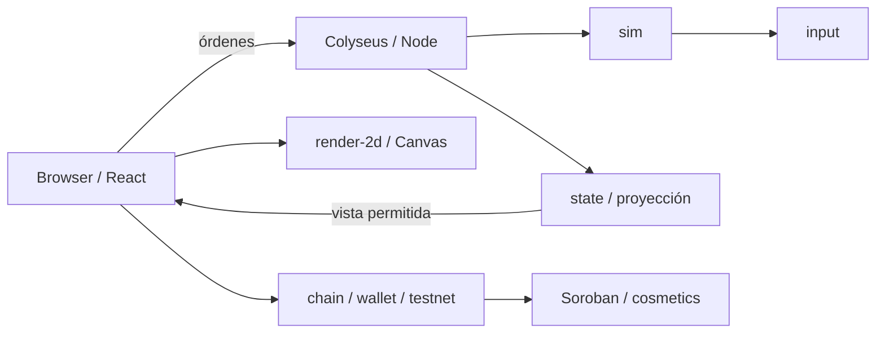

# Arquitectura inicial

## ADR-001: monorepo y dependencias

pnpm workspaces comparte tipos sin publicar paquetes. Vite/React presenta el juego;
Node/Colyseus mantiene salas; Rust/Soroban representa propiedad cosmética.
Se conserva el stack del brief y se pospone infraestructura que el bootstrap no usa.

La flecha a Soroban es la integración prevista: hoy chain consulta la red y el contrato
solo prueba el toolchain. No hay compra ni contrato desplegado en esta base.

## ADR-002: autoridad y determinismo

Solo el servidor avanza reglas. Comandos con secuencia creciente, escuadrón propio,
destino entero dentro del mapa y límite de frecuencia. Un mensaje no equivale a un turno.
Daño calculado antes de aplicarlo conserva simultaneidad. Unidades recorren la cuadrícula
en orden estable. El escenario inicial no necesita aleatoriedad; la futura semilla será privada.

La simulación no puede importar red, reloj de pared, wallet, inventario o render.
`pnpm check:boundaries` controla este límite. Replays futuros incluyen versión de reglas,
semilla y secuencia de entradas; no se publica información privada durante una partida.

## ADR-003: privacidad por construcción

No transmitir el mundo completo para luego ocultarlo con CSS. Cada cliente recibe
`viewFor(world, player)`; sus enemigos fuera de visión no se serializan.
Las reglas y ubicación de objetivos estáticos son públicas. El estado dinámico enemigo
debe pasar por la proyección. Las vistas de dos jugadores no tienen por qué tener el mismo hash.

El entrenamiento usa mensajes completos filtrados a 10 Hz, suficientes para validar el
contrato. Deltas e interpolación se medirán después. No usar un Schema compartido con
datos privados sin filtros equivalentes.

## ADR-004: renderer sustituible

Canvas 2D representa la cuadrícula isométrica y recibe únicamente vistas.
La UI React gestiona sesión, instrucciones y estados de wallet. El motor visual no aplica daño.
Canvas es una decisión de arranque, su rendimiento y calidad aún deben validarse en el
portátil objetivo. No se asume que el mock gráfico sea arte definitivo.

## ADR-005: persistencia y blockchain fuera del tick

La sala inicial vive en memoria y se pierde al reiniciar. PostgreSQL está planificado para
perfiles, resultados y una outbox de premios con clave única por campaña/jugador/logro.
La worker de emisión reclamará trabajos transaccionalmente y reconciliará resultados RPC
ambiguos antes de repetir. La dirección conectada requiere prueba de posesión SEP-10
antes de vincular identidad. Las compras las firma el jugador.

El contrato cosmetics tendrá sus permisos y límites revisados antes de emitir.
No hay RPC ni inventario en el ciclo de simulación; caída de RPC no detiene una campaña.

## ADR-006: entornos

Node funciona nativamente en Windows, Linux y macOS. Rust y Stellar CLI se ejecutan
en WSL2 en Windows y nativamente en los demás sistemas. Un wrapper portable calcula
las rutas. Nunca compartir `node_modules` o `target` entre Windows y Linux.

Un despliegue de frontend no implica servidor multijugador desplegado. Antes de publicar
una demo se deben configurar HTTPS/WSS, origin, límites de salas/conexiones, persistencia,
observabilidad y pruebas de reconexión. El proceso inicial escucha loopback por defecto.
