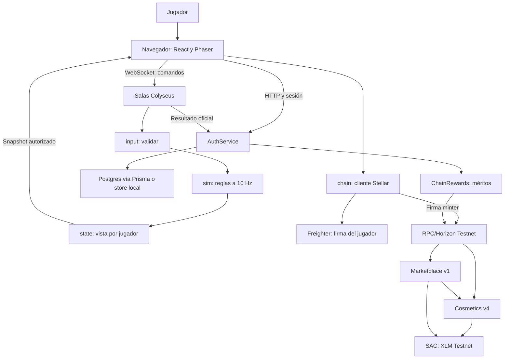

# Arquitectura técnica de la entrega

**Versión 1.0 · 10 de octubre de 2026.** Síntesis del código actual y de sus límites. [architecture.md](../architecture.md) conserva decisiones de diseño iniciales; cuando un texto histórico difiere, contrastar con código y evidencia fechada.

## 1. Componentes y responsabilidad

| Capa | Implementación | Responsabilidad |
|---|---|---|
| Interfaz | `apps/web`, React | Acceso, lobby, HUD, hangar y resultados |
| Presentación | Phaser y estado de UI | Render isométrico, cámara, entrada y audio |
| Salas | `apps/server`, Colyseus | Admitir usuarios, procesar mensajes y ejecutar ciclo de partida |
| Entradas | `packages/input` | Tipos y validación de mensajes no confiables |
| Simulación | `packages/sim` | Economía, movimiento, combate, objetivos y resultado |
| Proyección | `packages/state` | Construir vista autorizada por jugador |
| Cuentas | AuthService, stores, Prisma/Postgres | Identidad, perfil, wallet vinculada y progresión |
| Adaptador chain | `packages/chain` | Inventario, firma, simulación y envío de transacciones |
| Premios | ChainRewards | Emitir méritos obtenidos fuera del tick |
| Contratos | Rust/Soroban | Clases, propiedad, permisos, compra y mercado |

## 2. Diagrama de contexto y contenedores

La firma en Freighter autoriza una operación del jugador; la clave del minter autoriza premios. El navegador no contiene la clave privada del servidor. La compra no pasa por un saldo custodial del backend del juego.

## 3. Autoridad y flujo de gameplay

El cliente produce intención de mover, atacar, producir, mejorar o elegir. La sala asocia conexión con jugador, aplica validación de formato/fase/frecuencia y entrega comandos a la simulación. La simulación verifica condiciones lógicas y produce el siguiente estado; la proyección decide qué parte se envía.

El cliente representa esa vista y puede interpolar visualmente. No decide daño, recursos, ganador o XP. El protocolo utiliza secuencias para rechazar entradas obsoletas; los mensajes de campaña contienen versión. Los detalles de mensajes y fases están en [protocol.md](../protocol.md), y la fuente de formatos es [input](../../packages/input/src).

La niebla se protege filtrando información antes de la transmisión, no solo ocultando sprites. Al añadir efectos, resultados parciales o reconexión se debe verificar que no filtren posiciones/órdenes ocultas. Una vista filtrada no sustituye autenticación del asiento.

## 4. Determinismo y separación de dependencias

El motor recibe estado, entradas y semillas/configuración controladas. El reloj de la sala dispara el tick; las reglas no consultan wallet, RPC o inventario. El [check de boundaries](../../scripts/check-boundaries.mjs) verifica límites de paquetes y fuentes de tiempo/azar prohibidas en la simulación.

Esta separación permite probar gameplay sin navegador y preservar equidad económica: una caída del RPC no debe cambiar quién gana. Un bug o bloqueo del proceso de servidor aún puede interrumpir todas sus salas; el aislamiento lógico de chain no certifica aislamiento de recursos de CPU/memoria.

## 5. Modos y ciclo de vida

| Modo | Orquestación | Estado y limitaciones |
|---|---|---|
| Práctica | Sala de entrenamiento con IA | Invitado permitido; duración/dificultad configurables |
| Run contra IA | Cliente coordina tres mapas | Conserva aumentos; continuidad entre mapas en memoria del cliente |
| Campaña privada 1v1 | Máquina de campaña y sala | Dos cuentas, tres sectores, mismo mapa actual y resultado final |

La campaña reinicia economía/flota/base por sector y conserva aumentos. El ganador del sector final decide la campaña; no es al mejor de tres. La recuperación de asiento tiene una ventana de hasta 60 segundos y pausas limitadas; no sobrevive a un reinicio del proceso. No hay sustitución automática por bot al desconectarse.

## 6. Datos y persistencia

El [esquema Prisma](../../apps/server/prisma/schema.prisma) define `Account`, `Achievement`, `ChallengeBest` y `MatchAward`. La clave de resultado por cuenta/partida evita aplicar dos veces el mismo premio. La wallet tiene unicidad. El servidor mantiene copia de trabajo en memoria y espera las escrituras del store para confirmar cambios persistentes.

| Dato | Persistencia actual | Consecuencia |
|---|---|---|
| Cuenta, perfil y progresión | Postgres o archivo según entorno | Requiere almacenamiento real y backup verificado |
| Sesiones y desafíos | Memoria del proceso | Reinicio exige login/nuevo desafío |
| Mundo y salas | Memoria | Reinicio termina partidas |
| Selección cosmética/preferencias | Almacenamiento del navegador | No demuestra propiedad ni sincronización entre dispositivos |
| Propiedad/pagos/anuncios | Stellar Testnet | Depende de red y ciclo TTL/estado |
| Cola de emisión del minter | Promesas en memoria | Reconciliación/idempotencia presentes; outbox durable pendiente |

No se guardan movimientos individuales en Postgres por cada tick. La outbox persistente descrita en diseños anteriores es una evolución prevista; no figura en el esquema actual como tabla de premios pendientes.

## 7. Blockchain fuera del ciclo de combate

La cuenta gana méritos según el resultado oficial. Al terminar campaña o vincular wallet, el servidor puede solicitar sincronización. ChainRewards serializa las llamadas del minter y consulta el ID antes de emitir. Sin `STELLAR_MINTER_SECRET`, la emisión se desactiva y el juego sigue disponible.

Las compras y ventas nacen en el hangar, se firman con Freighter y se confirman vía RPC. El éxito requiere resultado confirmado; recibir un hash o tener una caché no basta. El [documento de contratos y flujo](CONTRACTS_AND_DATA_FLOW.md) explica atomicidad, permisos y errores.

## 8. Despliegue y disponibilidad

La configuración del repositorio contempla frontend estático en Vercel, servidor persistente Node/Colyseus en Railway y Postgres. Se configura una réplica porque sesiones, salas y usuarios de trabajo viven en memoria. No añadir réplicas sin diseñar routing, sesiones compartidas y consistencia de datos.

`/health` indica estado del proceso y modo de store; no acredita partidas funcionales, derechos de contenido o disponibilidad de RPC. La guía de [deployment](../deployment.md) registra además un fallo histórico de runtime/health check: debe verificarse el comportamiento aplicado por el proveedor, no solo la existencia de configuración.

Antes de beta ampliada: medir concurrencia, duración, costo por sesión, tiempo de tick p95/p99, consumo de memoria y backlog de premios. Definir tope de salas tras carga controlada, drenaje de mantenimiento, alertas y restauración. No se publica aquí una cifra de capacidad sin pruebas.

## 9. Decisiones arquitectónicas vigentes

| Decisión | Motivo | Tradeoff |
|---|---|---|
| Servidor autoritativo | Integridad y privacidad del gameplay | Costo de cómputo y disponibilidad central |
| Proyección por jugador | Evitar entregar información oculta | Requiere revisar cada mensaje nuevo |
| Simulación separada de UI/chain | Testabilidad y equidad | Adaptadores y contratos de datos explícitos |
| Catálogo cosmético opcional | Identidad sin compra de poder | Monetización depende de retención y preferencia |
| Mercado sin custodia | Pieza permanece con vendedor hasta compra | Necesita aprobación/propiedad vigentes y estado reconciliado |
| Una réplica durante prototipo | Mantener consistencia de estado en memoria | Reinicios interrumpen servicio; escalado pendiente |

## 10. Evidencia y próximos cambios

La aceptación técnica combinará tests de simulación/privacidad, dos clientes de campaña, Postgres real, UAT de wallet y revisión de contratos. Los pipelines están declarados en [CI](../../.github/workflows/ci.yml), pero un documento no certifica el resultado del pipeline.

Las prioridades posteriores son admisión/abuso, seguridad de sesión, recuperación, outbox, términos económicos protegidos, sincronización de cosméticos y contenido con derechos. Sus gates están en [ROADMAP.md](../business/ROADMAP.md); los riesgos y controles en [SECURITY.md](../security/SECURITY.md).
