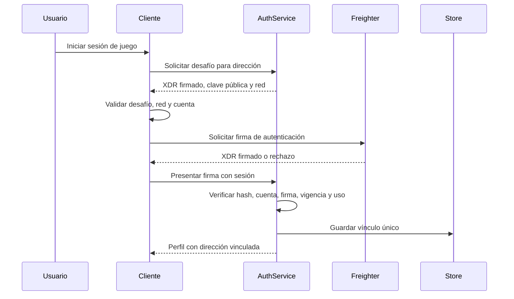
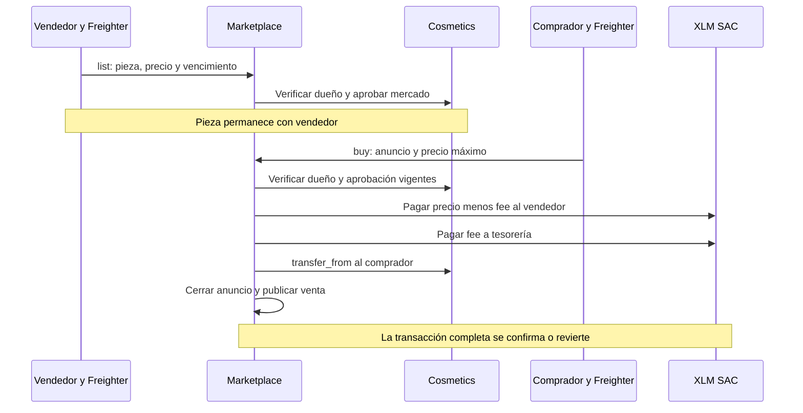
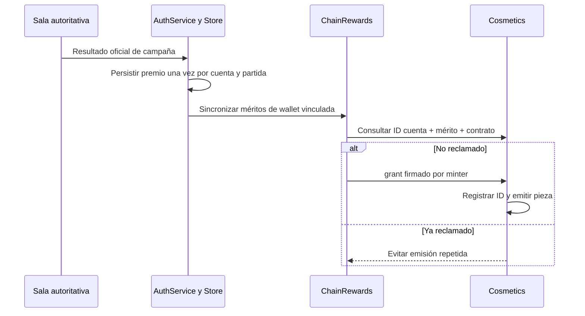

# Contratos y flujos de datos

**Versión 1.0 · 10 de octubre de 2026.** Referencia de interfaces actuales, basada en código y registro Testnet. No representa una API Mainnet aprobada.

## 1. Contratos y responsabilidades

| Contrato | Estado registrado | Datos principales | Operaciones |
|---|---|---|---|
| Cosmetics | v4, Testnet | Clases, piezas, propietarios, aprobaciones, roles e IDs de premio | Crear clase, precio, grant, compra, transferencias y consultas |
| Marketplace | v1, Testnet | Anuncios, índice de pieza, fee y configuración | Listar, cancelar, comprar, cambiar fee y consultas paginadas |
| XLM SAC | Pago configurado | Saldos XLM de prueba | Transferencias invocadas por los contratos |

IDs, hashes y transacciones se encuentran en [testnet.json](../../contracts/deployments/testnet.json). La identidad efectiva de contrato/red debe verificarse por entorno; no aceptar un contrato aportado libremente por un cliente para emitir premios o efectuar un pago.

## 2. Interfaz de Cosmetics

Las firmas siguientes resumen métodos del [contrato](../../contracts/cosmetics/src/lib.rs); no reemplazan el esquema compilado Soroban.

| Método | Actor autorizado | Efecto |
|---|---|---|
| `create_class(class_id, slot, family, transferable, supply_cap, price, uri)` | Admin | Registra definición; rechaza clase duplicada/configuración inválida |
| `set_price(class_id, price)` | Admin | Cambia precio de clase bajo validaciones |
| `propose_role(role, candidate)` / `accept_role(role)` | Admin / candidato | Cambio en dos pasos; conserva separación de roles |
| `grant(to, class_id, reward_id)` | Minter | Marca ID y emite; mismo ID repetido falla |
| `buy(buyer, class_id)` | Comprador | Transfiere precio a tesorería y emite |
| `transfer(from, to, token_id)` | Propietario | Transfiere pieza permitida |
| `approve(...)`, `approve_for_all(...)` | Dueño o actor permitido por método | Autoriza hasta ledger definido; cero revoca |
| `transfer_from(spender, from, to, token_id)` | Spender autorizado | Transfiere si propiedad/aprobación/familia lo permiten |
| Consultas | Lectura | `owner_of`, `class_of`, `get_class`, `tokens_of`, `has_class`, `is_reward_claimed` y otras |

`Merit` no admite precio positivo y no puede ser transferible; solo `Collection` admite configuración transferible. `grant` no inspecciona gameplay ni exige exclusivamente familia Merit. La fuente de elegibilidad es el servidor y la autoridad efectiva es el minter.

La compra primaria actual no recibe `max_price`, versión de cotización ni recibo único de compra. El admin puede cambiar el precio; el diseño futuro debe proteger los términos aceptados y probar la autorización generada por simulación. No se afirma aquí que el cambio permita cobrar cualquier importe sin firma válida.

## 3. Interfaz de Marketplace

| Método | Actor | Validaciones/efecto |
|---|---|---|
| `list(seller, token_id, price, live_until_ledger)` | Vendedor | Firma, propiedad, precio positivo, plazo y aprobación; reemplaza anuncio previo |
| `cancel(seller, listing_id)` | Vendedor original | Cierra anuncio; revoca aprobación del mercado cuando corresponde |
| `buy(buyer, listing_id, max_price)` | Comprador | Activo, vigente, precio máximo, no autocompra, propietario y aprobación; pago y transferencia |
| `set_fee(fee_bps)` | Admin | Límite máximo 1.000 puntos básicos |
| `get_listing`, `listing_of_token`, `listings`, `next_listing_id`, `fee_bps` | Lectura | Consulta individual o paginada |

La comisión registrada es 500 bps. La paginación limita resultados a 30 y acota escaneo por llamada; un cliente debe considerar anuncios cerrados/huecos, sin asumir que cada página representa todas las piezas existentes. Los plazos se expresan en ledgers: su equivalencia temporal depende del cierre de red, no de un reloj fijo garantizado.

## 4. Flujo de cuenta y wallet

El desafío basado en SEP-10 usa una transacción de secuencia cero que no ejecuta pagos. El servidor conserva por cuenta dirección, hash y expiración; solo acepta el desafío que emitió. En producción deberá anclarse la identidad del servidor y definirse el dominio real. El código utiliza dominios configurados para el prototipo; no se certifica resolución o control de dominio por su presencia en una constante.

La implementación no declara endpoints estándar completos de descubrimiento y emisión de JWT SEP-10. El flujo de sesión de juego sigue siendo el de AuthService. Referencia: [SEP-10 oficial](https://github.com/stellar/stellar-protocol/blob/master/ecosystem/sep-0010.md).

## 5. Compra primaria y reconciliación

1. El cliente consulta clase, propiedad y saldo; presenta red, precio y costos estimados.
2. `packages/chain` prepara/simula una llamada y solicita firma a Freighter.
3. El contrato verifica autorización del comprador y transfiere XLM a tesorería.
4. Emite la pieza; si una validación o transferencia falla, la operación no se completa parcialmente.
5. El cliente espera confirmación y refresca inventario; no acredita propiedad solo por recibir un hash.

Una compra repetida válida puede producir otra pieza; no existe el recibo idempotente que sí tiene grant. Si un envío queda en estado incierto, consultar su hash/estado antes de ofrecer repetirlo. La outbox de premios futura y la reconciliación de compras son problemas distintos.

## 6. Venta secundaria atómica

El fee se obtiene de configuración al comprar; no se fija en el anuncio. Para proteger los términos del vendedor se propone capturar y limitar la comisión aceptada o diseñar anuncios versionados. La venta tampoco promete regalía de autor: el 5 % registrado es comisión a tesorería, no royalty adicional.

## 7. Premio de mérito

La cola del minter es serial en memoria para evitar conflictos de secuencia. Un error no cambia el resultado del combate. La evolución propuesta es outbox durable, worker y reconciliación con hash/estado; no atribuir esa persistencia al código actual.

## 8. TTL, metadatos y fallos

Los contratos usan estado de instancia/persistente y llamadas de extensión de TTL. La futura operación debe medir y mantener ese estado, ensayar restauración y verificar continuidad de IDs de premio y propiedad. Los metadatos y archivos son off-chain; conservar una pieza en ledger no garantiza el alojamiento de su música o imagen. Referencia técnica: [estrategias de almacenamiento de Stellar](https://developers.stellar.org/docs/build/guides/storage/storage-strategies).

| Fallo | Comportamiento/limitación | Acción de operación propuesta |
|---|---|---|
| RPC no disponible | Compra/inventario/premio puede fallar; combate no espera RPC | Mostrar estado, reintentar con límites y reconciliar |
| Firma rechazada | No ejecutar la operación | Informar rechazo sin tratarlo como compra |
| Red/cuenta incorrecta | Verificación del cliente/adaptador | Probar cambio de cuenta durante firma |
| Anuncio vendido/vencido/aprobación revocada | Contrato rechaza compra | Actualizar anuncio y presentar motivo |
| Inventario al límite o cupo agotado | Emisión/transferencia puede fallar | Mostrar restricción antes y después de simulación |
| Resultado DB no guardado | Premio de cuenta no debe presentarse como guardado | Pruebas de fallo y recuperación |
| Reinicio de proceso | Sesiones, partidas y cola volátiles | Drenaje, login y reconciliación posterior |

## 9. Evidencia y criterios de revisión

Verificar autorización real, invariantes, transferencia atómica y parámetros económicos en [tests de Cosmetics](../../contracts/cosmetics/src/test.rs), [tests de Marketplace](../../contracts/marketplace/src/test.rs) y [tests chain](../../packages/chain/src). Completar además UAT con dos wallets, revisar fees y resolver respuesta ambigua. El registro Testnet es evidencia histórica complementaria, no prueba de todas las rutas.

El contrato actual no expone pausa general, reversión de ventas o actualización WASM como función de administración. Una necesidad futura de migración/pausa exige diseño y aprobación específicos, con impacto sobre propietarios. Los riesgos y gates de cambio están en [seguridad](../security/SECURITY.md) y [roadmap](../business/ROADMAP.md).
