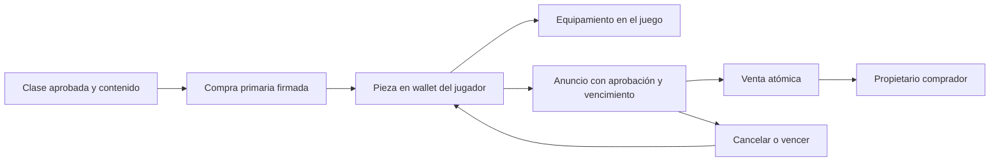

# Tipos de activos y derechos del usuario

**Versión 1.0 · 10 de octubre de 2026.** Taxonomía funcional del producto. No es una clasificación jurídica ni una valoración financiera.

## 1. Separación fundamental

Stellar Impulse distingue recursos de juego, registros de progresión, permisos cosméticos gratuitos y piezas registradas en Stellar. Que algo sea visible como carta, moneda o insignia no significa que sea un activo financiero o NFT.

| Tipo | Fuente de verdad | Transferible | Compra real en esta entrega | Efecto sobre combate |
|---|---|---|---|---|
| Metal | Simulación de servidor | No | No | Recurso para producir/mejorar dentro de partida |
| Unidades, bases y módulos | Simulación | No | No | Sí, según reglas |
| Aumentos/cartas y desbloqueos | Simulación/progresión | No | No | Sí, ganados mediante juego |
| XP, desafíos y mejores marcas | Cuenta y store | No | No | Progresión; no se compran |
| Cosméticos gratuitos | Catálogo y selección del cliente | No como token | No | Ninguno |
| Colecciones NFT | Cosmetics Soroban | Según clase; cuatro registradas sí | Compra con XLM de prueba | Ninguno |
| Méritos NFT | Logro del servidor + emisión en Cosmetics | No | No se venden | Ninguno |
| XLM Testnet | Ledger/SAC de prueba | Según operaciones de red | No acredita dinero real | Ninguno |

Energía es una función prevista sin economía operativa en la entrega actual. No se presenta un token de Energía, Metal o XP.

## 2. Categorías de personalización

| Hangar | Slot del contrato | Qué representa |
|---|---|---|
| Casco | `Livery` | Apariencia o librea visual, sin blindaje extra |
| Estela | `Trail` | Efecto de propulsión, sin velocidad extra |
| Insignia | `Emblem` | Identidad o mérito, sin estadísticas |
| Voz | `Announcer` | Audio del anunciador, sin información táctica privilegiada |
| Música | `Music` | Tema audiovisual, sin ventaja de gameplay |

Los nombres descriptivos de las piezas no implican efectos en reglas. Una librea con temática de blindaje no incrementa defensa.

## 3. Familias on-chain

| Familia | Capacidad del contrato | Situación del catálogo registrado |
|---|---|---|
| `Collection` | Puede configurarse transferible y comprable | Clases 1, 2, 5 y 6, transferibles y de precio positivo |
| `Merit` | Precio positivo prohibido; transferencia prohibida | Clases 3 y 4, precio cero y no transferibles |
| `Veteran` | Familia existente; no transferible | No hay clase Veteran entre las seis del registro |

No confundir soporte de un enum con una colección lanzada. La incorporación de Veteran requerirá reglas de elegibilidad, presentación y datos de clase; no es un beneficio ya disponible.

## 4. Clase, pieza, propiedad y equipamiento

Una **clase** define familia, slot, transferibilidad, cupo, cantidad emitida, precio y URI. Una **pieza** tiene ID de token, clase y propietario. Un usuario puede tener varias piezas de una misma clase; la capacidad de equipar se comprueba por clase poseída, no por tener un saldo fungible.

La propiedad se consulta en contrato. La caché del navegador ayuda a presentar inventario, pero puede quedar desactualizada o manipularse. Una pieza vendida debe dejar de considerarse equipable cuando se actualiza su propiedad. Las piezas gratuitas no requieren wallet.

En la versión actual, la personalización es principalmente local: la aceptación de apariencia vista por el rival está pendiente. Comprar un NFT no acredita que todos los modos ya sincronicen su presentación a otros jugadores.

## 5. Emisión y oferta

Todas las clases del registro Testnet tienen `supplyCap: 0`, es decir, no tienen un máximo de emisión de clase configurado. Los límites de inventario por propietario son restricciones operativas y no convierten una clase en escasa.

La compra primaria emite una pieza después del pago. `grant` permite al minter emitir una clase utilizando un identificador único. El servidor actualmente mapea sus méritos a las clases 3 y 4; el contrato no evalúa el resultado de una partida y no limita `grant` a esos dos méritos. Esa responsabilidad requiere controles operativos.

El cupo futuro de una edición limitada deberá establecerse y verificarse en contrato antes de anunciarse. No usar rareza de gameplay, como oro o prismático de aumentos, para sugerir escasez comercial de un NFT.

## 6. Ciclo de vida de colección

El mercado no recibe la pieza en depósito al listar. La aprobación habilita una transferencia posterior bajo los controles del contrato. Cancelar retira el anuncio y revoca la aprobación del mercado cuando corresponde; vencer impide su compra. Transferir directamente la pieza deja obsoleto el anuncio, y el mercado verifica propietario al comprar.

Una transferencia on-chain no garantiza un comprador futuro, precio mínimo, liquidez o soporte indefinido del juego. La colección no da participación societaria ni derechos sobre tesorería.

## 7. Ciclo de vida de mérito

Un resultado oficial genera el mérito en la cuenta. Después de vincular una wallet mediante firma, el servicio consulta el identificador por cuenta + mérito + contrato y emite si aún no está reclamado. La emisión utiliza la clave del minter; el jugador no compra el reconocimiento.

Primera victoria corresponde a ganar la campaña 1v1 capturando el Núcleo final, según el catálogo y las reglas de premios. Exploración corresponde a terminar una campaña 1v1, gane o pierda. Rendiciones, desconexiones y otras causas de finalización deben revisarse en las pruebas de premios; no se infiere elegibilidad por el nombre de una pantalla.

El mérito emitido no se vende ni se transfiere. Desvincular una wallet no devuelve el NFT al servidor ni permite reclamar una segunda copia en otra dirección. Recuperación de mérito por pérdida de clave no es una función actual.

## 8. Derechos y límites que debe mostrar cada ficha

La ficha comercial futura debe especificar uso permitido en el juego, transferibilidad, dependencia del cliente/servidor, disponibilidad de archivos, cupo real, red, contrato y costos. El titular del NFT obtiene la propiedad de la pieza registrada, dentro de esas funciones; no obtiene automáticamente derechos de autor del audio/arte ni permiso de extraerlo y venderlo.

La música está excluida de MIT por [LICENSE](../../LICENSE). El acceso local permitido no equivale a autorización comercial de distribución o venta. La voz sintética tampoco se presenta como propiedad sobre la identidad de una persona. Las condiciones deben concordar con autorizaciones de autores y proveedores.

## 9. Ficha mínima de alta de un activo

| Campo | Requisito propuesto |
|---|---|
| Identidad | Clave de catálogo, clase, slot, red y contrato |
| Fuente | Archivo/metadatos, autor, origen y versión/hash |
| Economía | Precio y unidad, cupo, transferibilidad y comisión aplicable |
| Derechos | Titular, licencia, permisos comerciales y evidencia |
| Uso | Comportamiento visual/audio y ausencia de impacto competitivo |
| Operación | Responsable, disponibilidad, TTL y restauración |
| Estado | Propuesto, en QA, publicado o retirado de oferta |

El [informe de activos](ASSET_REPORT.md) aplica esta taxonomía al inventario observado. El contrato no incluye una función de borrado general de NFT; retirar una pieza de la oferta futura no equivale a eliminar la propiedad ya registrada.
