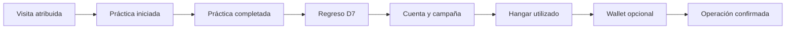

# Go-to-market y plan de marketing

**Versión 1.0 · 10 de octubre de 2026.** Plan de adquisición propuesto. No acredita campañas ejecutadas, alianzas, usuarios adquiridos ni métricas observadas.

## 1. Posicionamiento y mensaje

**Mensaje principal:** «Estrategia espacial en tu navegador. Aprende, compite y personaliza tu flota sin comprar poder».

El material inicial mostrará una orden, una captura y una decisión táctica. La propiedad digital aparecerá después de explicar el juego. Para comunidades Stellar se mostrará adicionalmente el recorrido de firma y el mercado Testnet. Toda pieza distinguirá red de prueba, funcionalidades disponibles y próximas.

El tono será claro, táctico y accesible, siguiendo el [manual de marca](../brand-manual.md). No se usarán promesas de rentabilidad, escasez inexistente o cifras de tracción sin respaldo.

## 2. Público de entrada y reclutamiento

Se proponen cohortes de adultos hispanohablantes que puedan jugar en computador: jugadores RTS/indie, universitarios y comunidades de amigos. La cohorte de wallet se reclutará por separado para no confundir dificultad de juego con dificultad de firma. Idioma, equipo, experiencia RTS y familiaridad con wallet se registrarán con consentimiento y preguntas mínimas.

El primer objetivo es reclutar 100 personas que inicien una práctica durante una ventana de cuatro semanas. Es una meta de experimento, no una cifra actual. El acceso se ampliará por lotes según capacidad observada y soporte disponible.

## 3. Embudo con eventos propuestos

| Paso | Evento propuesto | Propiedades mínimas |
|---|---|---|
| Visita | `landing_view` | Canal, campaña, versión e idioma |
| Primera experiencia | `practice_started`, `tutorial_completed`, `practice_completed` | ID de sesión, modo, dificultad y duración |
| Regreso | `session_started` | ID pseudónimo y fecha UTC para cohortes |
| Cuenta/campaña | `account_created`, `campaign_started`, `campaign_completed`, `campaign_abandoned` | Motivo y versión; sin email en analítica |
| Identidad | `hangar_opened`, `cosmetic_equipped` | Categoría y clase; gratuito o chain |
| Wallet | `wallet_link_started`, `wallet_link_completed`, `wallet_link_failed` | Red y código de error; sin secretos ni XDR reutilizable |
| Compra/mercado | `purchase_intent`, `transaction_submitted`, `transaction_confirmed`, `transaction_failed` | Tipo, clase y código; hash de tx solo si es necesario |

Estos nombres son un contrato de instrumentación propuesto, no una descripción de un pipeline ya implementado. Los resultados finales y confirmaciones deben provenir del servidor o de reconciliación en red. Evitar contar doble una misma sesión o transacción tras reintentos; excluir cuentas internas e intercambios incentivados de la métrica comercial orgánica.

## 4. Canales y experimentos

| Canal | Acción concreta | Ventana y muestra objetivo | Indicador de éxito | Límite |
|---|---|---|---|---|
| Comunidades RTS/indie | Publicar clip táctico y acceso a playtest con permiso | 2 semanas; 30 prácticas iniciadas | Finalización y regreso D7 | Evitar mensajes masivos o repetidos |
| Universidades y grupos locales | Sesión guiada con parejas | 2 sesiones; 20 participantes | Comprensión y campañas completas | Distinguir sesión guiada de adquisición autónoma |
| Comunidad Stellar | Demo de dos wallets después de una partida | 2 semanas; 20 intentos de vinculación | Éxito de flujo y comprensión de fees | Testnet; no tratar fondeo de prueba como ingreso |
| Microcreadores | Invitar a probar y explicar una decisión táctica | 3 propuestas de colaboración | Prácticas atribuidas y D7 | No afirmar acuerdos antes de aceptarlos |
| Contenido propio | Clips, guía breve y notas de desarrollo | 2 piezas semanales durante 4 semanas | Activaciones por pieza | Calendario sujeto a capacidad |

Los tamaños son metas de reclutamiento; no se suman como usuarios únicos si una persona entra por varios canales. Se registrarán tiempo del equipo, gasto y coste de incentivos, incluso si el canal no cobra publicidad.

## 5. Fases de lanzamiento

| Fase | Trabajo | Condición de salida |
|---|---|---|
| Preparación, Q4 2026 | Demo, materiales, términos de playtest, soporte y UAT | Ruta crítica reproducible y límites publicados |
| Beta cerrada, Q1 2027 | Reclutamiento por lotes, eventos y entrevistas | Cohortes maduras y fallos prioritarios cerrados |
| Beta ampliada, Q2 2027 | Canales que retienen, contenido y pruebas de catálogo | Estabilidad, demanda y costo por jugador medidos |
| Piloto económico condicionado, Q3 2027 | Oferta pequeña, condiciones comerciales y conciliación | Aprobación de seguridad, derechos y alcance jurídico |

No se autoriza gasto ni publicación con este documento. Es un plan para ejecutar cuando el equipo asigne responsables y presupuesto; tampoco obliga a lanzar Mainnet en Q3.

## 6. KPIs con definiciones

| Métrica | Definición | Objetivo inicial propuesto |
|---|---|---:|
| Activación práctica | Personas nuevas que completan su primera práctica / nuevas que la inician | ≥ 60 % |
| Tutorial completo | Nuevos que completan tutorial / nuevos que lo empiezan | ≥ 70 % |
| Retención D1 | Activados que juegan en el día calendario siguiente / cohorte activada madura | ≥ 25 % |
| Retención D7 | Activados que juegan exactamente en el séptimo día / cohorte activada con 7 días de observación | ≥ 10 % |
| Campaña finalizada | Campañas completas / campañas iniciadas | ≥ 80 % |
| Sesión interrumpida por fallo | Sesiones terminadas por error técnico / sesiones iniciadas | ≤ 2 % |
| Éxito de transacción | Operaciones confirmadas / intentos firmados y enviados | ≥ 95 % en UAT Testnet |
| Conversión primaria | Compradores únicos reales / MAU elegibles del mismo período | Por validar; escenarios 3–5 % |
| CAC de activación | Gasto atribuible / nuevos que completan práctica | Medir; comparar con contribución |
| Recurrencia de compra | Compradores que repiten / compradores con ventana completa | Sin meta hasta obtener línea base |

MAU contará usuarios únicos que juegan al menos una sesión durante 30 días; abrir la landing, conectar una wallet o consultar inventario no basta. En analítica se usarán días UTC documentados para evitar mezclar zonas horarias; los eventos presenciales se comunicarán en hora de Bolivia. Una campaña abandonada no equivale automáticamente a un fallo técnico.

Los objetivos son decisiones internas, no benchmarks externos. Informar numerador, denominador y versión. Con 100 activados, 10 regresos D7 equivalen a 10 %, pero siguen siendo una estimación incierta; repetir cohortes y reportar intervalo de confianza antes de escalar gasto.

## 7. Presupuesto de aprendizaje

Se propone un tope de USD 600 para un ciclo de experimentos, pendiente de disponibilidad: USD 150 para piezas audiovisuales, USD 150 para sesiones/comunidad, USD 150 para colaboración acotada y USD 150 para distribución pagada de prueba. Registrar también horas aportadas y cualquier incentivo.

Si esos USD 600 generan 300 activaciones, el CAC sería USD 2. El [modelo financiero](TOKENOMICS_FINANCE.md) muestra que la contribución ilustrativa base a tres meses sería USD 0,8496; ese resultado obligaría a corregir retención, margen o canal antes de convertir publicidad en gasto recurrente.

Las acciones sin gasto publicitario no son gratis si consumen tiempo o contenido. El presupuesto semestral incluye otros ciclos y está en [BUSINESS_PLAN.md](BUSINESS_PLAN.md); este tope no se agrega automáticamente encima de esa partida.

## 8. Plan de contenido de cuatro semanas

| Semana | Pieza y objetivo | Llamada a la acción | Evidencia a revisar |
|---|---|---|---|
| 1 | Clip de explorar, capturar y producir | Completar primera práctica | Activación y tiempo de aprendizaje |
| 2 | Guía de counters y formación | Volver y probar otra composición | D7 y segunda sesión |
| 3 | Campaña con dos jugadores | Invitar a una persona conocida | Campañas iniciadas/completadas |
| 4 | Hangar y demo de propiedad | Probar personalización y wallet opcional | Uso gratuito, intención y errores |

Los clips se generarán de una versión identificable. La demo económica dirá Testnet y mostrará costo, firma y resultado. Las métricas de vistas se usarán para diagnosticar distribución; la métrica de valor seguirá siendo jugar y volver.

## 9. Retención, comunidad y soporte

La retención se buscará mediante aprendizaje, objetivos claros, variedad táctica y progresión. Las temporadas, desafíos comunitarios y recomendaciones entre amigos son experimentos futuros; no requieren premios económicos. Evitar referidos remunerados en activos que incentiven cuentas falsas o compras circulares.

Publicar notas de cambios, reconocer feedback y ofrecer un mecanismo de bugs con versión, pasos y resultado esperado. Moderar conflictos y conductas abusivas con reglas comunicadas antes de eventos. El canal y su responsable deben asignarse antes del reclutamiento; no se presupone una comunidad ya creada.

## 10. Criterios para continuar, cambiar o detener

Si la activación falla, reducir complejidad del primer recorrido. Si D7 falla durante dos cohortes maduras, concentrarse en gameplay antes de ampliar distribución. Si el flujo de wallet falla, conservar el juego accesible y frenar la promoción económica. Si aparecen abuso o incidentes, limitar el acceso según el plan de seguridad. Si un canal produce registros sin partidas, descartarlo para crecimiento hasta entender la causa.

La evaluación mensual combinará cohortes, costo, entrevistas e incidentes. No optimizar transacciones por sí solas ni presentar wash trading, bots o cuentas del equipo como tracción.
