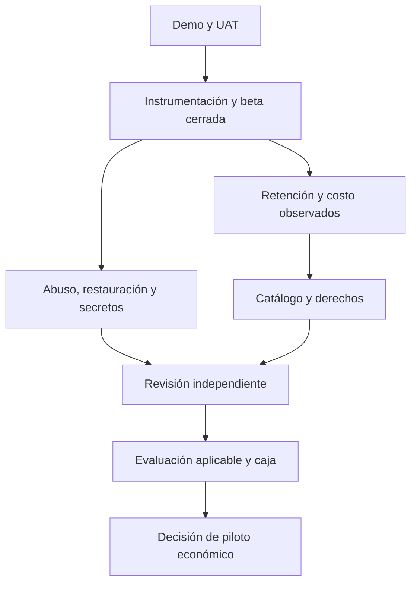

# Roadmap posterior al hackathon

**Versión 1.0 · 10 de octubre de 2026.** Q1, Q2 y Q3 corresponden a **2027**, después de la entrega de octubre de 2026. Son ventanas propuestas; avanzar exige evidencia, capacidad y presupuesto.

## 1. Entrega del evento frente a producción

| Área | Construido en la entrega de hackathon | Trabajo posterior |
|---|---|---|
| Gameplay | Simulación, niebla, economía de Metal, flotas, bases y aumentos | Balance medido, rendimiento y contenido validado |
| Modos | Práctica, run contra IA y campaña privada 1v1 | Experiencia estable y mapas distintos en campaña PvP |
| Persistencia | Cuenta, XP, logros, mejores marcas y resultados | Backups probados y política de recuperación |
| Blockchain | Dos contratos Testnet, cliente chain, vinculación y premios | UAT Freighter, costos/TTL y revisión independiente |
| Cosméticos | Catálogo de cinco categorías y opciones gratis | Identidad visible entre rivales y licencias comerciales completas |
| Operación | Configuración de despliegue y health check | Monitoreo, límites globales y capacidad certificada por pruebas |
| Negocio | Tesis y escenarios documentados | Cohortes, demanda, CAC y costos observados |

No se considera construido un sistema público de matchmaking, escalado horizontal, recuperación completa de partida o auditoría externa. Energía sigue fuera de la economía operativa actual.

## 2. Cierre del evento y Q4 2026 — evidencia reproducible

| Hito | Responsable funcional | Dependencia | Criterio de aceptación |
|---|---|---|---|
| Congelar demo identificable | Producto + plataforma | Build reproducible | Commit, configuración pública y recorrido registrado |
| Aceptar juego con dos cuentas | QA/producto | Frontend y servidor accesibles | Crear/unirse/listo, sectores y resultado probado |
| Aceptar economía con dos wallets | Contratos + UX | Freighter Testnet | Comprar, equipar, vender, cancelar, recibir mérito y rechazar firma |
| Validar persistencia/despliegue | Plataforma | Postgres y runtime | Cuenta sobrevive reinicio; sesión/partida volátiles explicadas; `/health` comprobado |
| Organizar evidencia | Operación | Resultados de pruebas | Actualizar casos de QA con fecha y fallos, sin credenciales |

El [playtest del 9 de octubre](../qa/playtest-2026-10-09.md) contiene casos pendientes; este roadmap no los marca aprobados. Resolver primero defectos que impidan la ruta crítica.

## 3. Q1 2027 — beta cerrada y controles esenciales

**Objetivo:** comprobar aprendizaje y retorno con una cohorte limitada, y reducir abuso antes de aumentar acceso.

| Entregable | Responsable | Criterio de salida |
|---|---|---|
| Instrumentación mínima | Plataforma + comunidad | Eventos deduplicados, consentimiento y cohortes D1/D7 |
| Primera cohorte y entrevistas | Producto + comunidad | Meta de 100 prácticas iniciadas y 15 entrevistas, con resultado documentado |
| Abuso y admisión | Seguridad + plataforma | Límites de invitados/HTTP/salas/conexiones; tests de ausencia de Origin y saturación |
| Seguridad de sesión y secretos | Seguridad | Tratamiento de XSS, reautenticación sensible y rotación ensayada |
| Datos y restauración | Plataforma | Backup y recuperación en entorno separado con tiempo medido |
| Observabilidad y costo | Plataforma + operación | Dashboard de tick, memoria, errores y costo por sesión |
| Feedback y balance | Producto | Cambios vinculados a playtests, sin ventajas comprables |

Gate de Q1: no hay fallos críticos conocidos en el alcance expuesto; ruta Freighter aceptada; denominadores de activación y D7 disponibles; capacidad de soporte asignada. Si los datos no muestran aprendizaje/retorno, mantener beta cerrada y revisar experiencia.

## 4. Q2 2027 — beta ampliada y validación de demanda

**Objetivo:** crecer con evidencia de estabilidad y evaluar personalización sin dar por probadas compras reales.

| Entregable | Responsable | Criterio de salida |
|---|---|---|
| Cohortes ampliadas | Comunidad + producto | D1 ≥ 25 %, D7 ≥ 10 % como objetivos; muestras e incertidumbre publicadas |
| Estabilidad y capacidad | Plataforma | Fallos técnicos ≤ 2 % y campañas completas ≥ 80 %; prueba de carga del tope elegido |
| Identidad compartida | UX + plataforma | Rival ve cosmético autorizado sin revelar inventario privado ni alterar reglas |
| Variedad de mapas 1v1 | Gameplay | Al menos un mapa adicional aprobado por balance y paridad de estado |
| Operación de premios | Contratos + plataforma | Outbox/worker persistente y reconciliación tras respuesta ambigua |
| Protección de términos económicos | Contratos + seguridad | Precio máximo/cotización primaria y comisión aceptada protegidos y probados |
| Derechos y catálogo | Contenido + operación | Autorizaciones comerciales y fichas de activos revisadas |
| Experimentos comerciales | Producto + finanzas | Preferencias, intención y costo total observados; Testnet separado de dinero real |

Gate de Q2: demanda razonable de personalización, capacidad y costos medidos, derechos suficientes y controles económicos listos para revisión externa. Si no existe margen plausible, no aumentar adquisición ni comprometer colecciones pagadas.

## 5. Q3 2027 — decisión de producción y piloto limitado

**Objetivo:** determinar si un lanzamiento económico acotado es justificable. Mainnet permanece condicionado.

| Entregable | Responsable | Criterio de salida |
|---|---|---|
| Revisión independiente | Seguridad + contratos | Informe con alcance/commit, correcciones y retest; cero críticos/altos abiertos en el alcance de pagos |
| Evaluación aplicable | Operación + asesoría | Jurisdicciones, derechos, privacidad, condiciones y tratamiento de pagos revisados |
| Firma privilegiada protegida | Seguridad | Admin/minter/tesorería separados, permisos mínimos y recuperación documentada |
| TTL, metadatos y red | Contratos + plataforma | Restauración, costos, disponibilidad y rechazo de red/contrato incorrectos probados |
| Contabilidad y soporte | Finanzas + comunidad | Conciliación, fees, incidencias, política comercial y responsables asignados |
| Decisión de piloto | Equipo responsable | Presupuesto, límite de exposición, go/no-go escrito y versión fijada |

Una limitación en la interfaz no restringe automáticamente llamadas directas al contrato. Si el piloto necesita topes de emisión o acceso efectivo, deben estar implementados donde se aplican o el equipo deberá reducir el alcance. No se presume una pausa on-chain: los contratos actuales no exponen un interruptor general de emergencia.

Si el gate se aprueba, desplegar un alcance pequeño, monitorizar y evaluar antes de ampliarlo. Si se rechaza, mantener Testnet y comunicar qué requisitos siguen abiertos.

## 6. Opciones posteriores, sin fecha comprometida

Matchmaking público, temporadas, 2v2, nuevas categorías, acceso móvil, wallets embebidas y patrocinio de fees pueden evaluarse tras retención y operación. Cada opción necesita una hipótesis de usuario, presupuesto y análisis de riesgos. No se anuncia como función existente.

## 7. Dependencias y reglas de priorización

Prioridad: integridad del juego y datos; aceptación crítica; medición; contenido; adquisición; expansión. Los hallazgos que afecten fondos o permisos tienen prioridad sobre nuevas funciones.

## 8. Seguimiento y cambios de plan

Cada hito se registrará con estado pendiente/en curso/bloqueado/aceptado, responsable, commit, pruebas, costo y riesgo residual. No se marca aceptado por la sola fecha del calendario. Si capacidad o presupuesto cambian, el equipo actualizará fechas y alcance, conservará la razón de la decisión y evitará presentar el plan anterior como una promesa cumplida.
