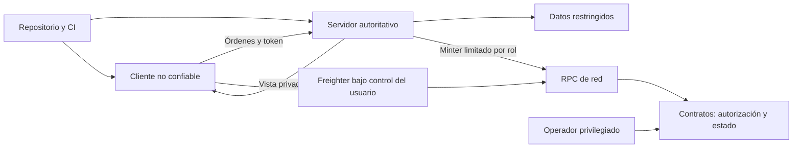

# Política de seguridad y modelo de amenazas

**Stellar Impulse · versión 1.0 · corte: 10 de octubre de 2026.** Alcance: cliente, servidor, cuentas, datos, dependencias, despliegue, firma y contratos. Este documento separa controles encontrados en código de políticas propuestas. No es una auditoría externa ni autorización para operar con fondos reales.

## 1. Objetivos e invariantes

1. El servidor determina órdenes válidas, resultado y progresión; el cliente no declara victoria o XP.
2. Cada jugador recibe únicamente su vista autorizada del mundo.
3. Compras e inventario NFT no modifican estadísticas de combate.
4. Una dirección solo se vincula después de verificar una firma del desafío emitido a esa cuenta.
5. El usuario firma sus compras; el servidor no custodia su clave privada.
6. Una venta liquida pago, comisión y transferencia dentro de la misma transacción o revierte.
7. Un mérito con el mismo identificador no se emite dos veces.
8. Red, contrato, activo y términos de la operación deben coincidir con lo que el usuario acepta.

La autoridad del servidor no elimina bots, colusión, ataques a infraestructura ni errores de reglas. La separación de roles no vuelve inocua una clave privilegiada comprometida.

## 2. Activos y fronteras de confianza

| Activo protegido | Riesgo principal | Fuente de autoridad |
|---|---|---|
| Sesión y cuenta | Robo de token, enumeración, acceso ajeno | AuthService y store |
| Contraseña y email | Exposición de credenciales/datos | Backend y Postgres/archivo local |
| Estado oculto de partida | Ventaja por inspección de red | Proyección del servidor |
| XP, logros y resultados | Manipulación o doble premio | Resultado oficial y persistencia |
| Firma y vínculo de wallet | Vinculación ajena o replay | Desafío verificado |
| Propiedad, anuncios y pagos | Transferencia no autorizada, términos cambiados | Contratos Soroban |
| Admin/minter/tesorería | Emisión falsa o cambios privilegiados | Autorizaciones de contrato |
| Código y contenido | Dependencia o release comprometido | Repositorio, CI y proceso de entrega |

RPC, navegador, extensiones y paquetes son dependencias externas. Un resultado mostrado por el cliente o una caché local no acredita propiedad. La configuración de dominios y proveedor no sustituye la autorización de cada operación.

## 3. Controles presentes y evidencia

| Control encontrado | Evidencia | Límite |
|---|---|---|
| Contraseñas con salt aleatorio, scrypt y comparación segura | [auth.ts](../../apps/server/src/auth.ts) | Hash síncrono en el proceso del tick; parámetros/carga requieren revisión |
| Tokens aleatorios, expiración de 24 h y logout | `AuthService` y [cliente](../../apps/web/src/auth/client.ts) | Sesiones en memoria; token en `sessionStorage`, accesible a JavaScript |
| Presupuesto compartido de login/registro | [app.ts](../../apps/server/src/app.ts) | Burst 20 y recarga 2/s; no cubre todas las rutas |
| Origin de WebSocket y payload máximo de 4.096 bytes | `WebSocketTransport` en `app.ts` | Acepta conexiones sin Origin; no demuestra admisión pública segura |
| Validación de órdenes, secuencias y frecuencia | [input](../../packages/input/src), [campaña](../../apps/server/src/campaign-room.ts), [práctica](../../apps/server/src/training-room.ts) | No equivale a cuotas globales de salas/conexiones |
| Vista privada por jugador | [state](../../packages/state/src) | Revisar cada nuevo campo/evento y reconstrucciones |
| Desafío de cinco minutos, hash ligado a cuenta y consumo único | `AuthService` y [wallet-link](../../packages/chain/src/wallet-link.ts) | Firma del servidor efímera; descubrimiento SEP-10 completo pendiente |
| Wallet única y escrituras de progresión | [Prisma](../../apps/server/prisma/schema.prisma), store y auth | Se debe verificar persistencia/restauración del entorno real |
| Roles separados y cambio en dos pasos en Cosmetics | [cosmetics](../../contracts/cosmetics/src/lib.rs) | No certifica hardware, MFA ni custodia operativa de claves |
| Compra secundaria con precio máximo, propietario y aprobación vigentes | [marketplace](../../contracts/marketplace/src/lib.rs) | Comisión se lee al ejecutar, sin fijarla por anuncio |
| Idempotencia de emisión | `reward_id`, `is_reward_claimed` y [chain-rewards](../../apps/server/src/chain-rewards.ts) | No es una outbox persistente ni límite a identificadores nuevos |
| Checks de límites de paquetes y árbol publicable | [scripts](../../scripts), [CI](../../.github/workflows/ci.yml) | Escaneo por patrones; no garantiza ausencia absoluta de secretos |

## 4. Método de threat modeling

Se usa STRIDE para ordenar suplantación, alteración, repudio, exposición, denegación de servicio y elevación de privilegios. Las prioridades siguientes son una evaluación cualitativa del diseño, no resultados de un pentest. **P0:** integridad de fondos/claves o control crítico; **P1:** acceso, datos, disponibilidad o términos económicos; **P2:** mejora operativa. La prioridad depende de que el componente esté efectivamente expuesto.

| ID / categoría | Escenario | Control actual | Riesgo residual y tarea | Prioridad / función |
|---|---|---|---|---|
| T01 · Suplantación | Token de sesión robado permite actuar como usuario | Token con expiración y logout | XSS puede leer `sessionStorage`; revisar CSP, persistencia y reautenticación | P1 · plataforma |
| T02 · Suplantación | Replay o firma de otra wallet | Hash/cuenta/tiempo/firma verificados | Anclar identidad del servidor y probar cliente malicioso, red y cuenta cambiadas | P1 · contratos |
| T03 · Alteración | Cliente intenta mover flota ajena o otorgarse XP | Órdenes y resultados autoritativos | Ampliar casos negativos por cada mensaje nuevo | P1 · gameplay |
| T04 · Exposición | Enemigos ocultos se filtran en snapshots o eventos | Proyección privada | Test de no interferencia sobre campos, efectos y reconexión | P1 · state |
| T05 · DoS | Invitados o rutas no limitadas consumen CPU/memoria | Login/registro limitados | `/auth/guest` calcula scrypt fuera de ese bucket; cuotas por ruta y globales | P1 · plataforma |
| T06 · DoS | WebSockets/salas masivas saturan el tick | Payload y límites de órdenes | Origin ausente permitido; admitir identidad/guest acotado y limitar salas/conexiones | P1 · plataforma |
| T07 · Elevación | Minter robado emite premios falsos | Rol y rechazo de ID duplicado | Emite con IDs nuevos; proteger firma, presupuesto de fees y detectar anomalías | P0 antes de dinero real · seguridad |
| T08 · Elevación | Admin cambia clases, precio, roles o comisión | `require_auth`, roles de Cosmetics y límite de fee | Firma protegida, doble revisión y ensayo de rotación | P0 antes de dinero real · seguridad |
| T09 · Alteración | Se venden piezas ajenas, vencidas o no transferibles | Propietario, aprobación, plazo y familia | Probar llamadas directas, transferencia concurrente y aprobación revocada | P0 para fondos · contratos |
| T10 · Alteración | Términos cambian entre UI y ejecución | Mercado tiene `max_price` | Compra primaria no expone precio máximo; comisión no fija términos del vendedor | P1 · contratos/UX |
| T11 · Repudio | Timeout se trata como fracaso y se repite operación | Comprobación de mérito idempotente | Persistir hash/estado y reconciliar antes de reenviar; compra no tiene recibo idempotente propio | P1 · contratos/plataforma |
| T12 · Exposición | Logs, backups o bundle incluyen secretos/datos | Secret de minter leído en servidor; check público | Redacción, inventario de secretos, acceso mínimo y pruebas del bundle | P0/P1 · seguridad |
| T13 · Alteración | Dependencia o CI produce un release malicioso | Lockfiles, acciones fijadas, permisos de lectura en CI | Inventario/SBOM, revisión de actualizaciones y separación de deploy | P1 · plataforma |
| T14 · DoS / alteración | RPC cae, estado archiva o índice entrega inventario viejo | Chain fuera del tick y extensiones TTL | Restauración y monitoreo TTL; refrescar propietario antes de usar/listar | P1 · contratos |
| T15 · Alteración | Reinicio o falla DB pierde resultado/premio | Writes esperan store e IDs de resultado | Partida y cola de emisión volátiles; recuperación y outbox verificables | P1 · plataforma |
| T16 · Abuso lógico | Varias cuentas coluden o inflan mercado | Rechazo de autocompra de la misma dirección | Direcciones distintas pueden coordinarse; detectar patrones y excluir métricas | P2 en Testnet; revisar antes de piloto · operación |

## 5. Gestión de secretos propuesta

`STELLAR_MINTER_SECRET` y `DATABASE_URL` son secretos de backend. `COSMETICS_CONTRACT_ID`, URLs y direcciones públicas son configuración, aunque su integridad también importa. Variables `VITE_*` se incorporan al bundle y no deben contener credenciales. Las credenciales de proveedores de contenido se mantendrán fuera del cliente y del árbol público.

Política a implementar: gestor de secretos o variables protegidas del proveedor, identidad de servicio por entorno, acceso mínimo, inventario con propietario y uso, rotación por incidente/cambio de responsables y revisión de permisos trimestral. No compartir semillas por chat, capturas, issues o documentos. Eliminar un secreto de Git no lo vuelve seguro: revocar o rotar y revisar exposición.

La firma privilegiada de producción requerirá una solución evaluada de almacenamiento protegido o firma externa; el diseño debe probar compatibilidad con Soroban. El cambio en dos pasos de roles de Cosmetics se ensayará antes de necesitarlo. Marketplace no expone en la interfaz actual una rotación equivalente de su admin; documentar esa limitación y resolverla para el alcance de producción.

## 6. Matriz de acceso

| Actor | Permiso permitido | Restricción |
|---|---|---|
| Invitado | Práctica y sesión acotada | Sin administración; cuotas y expiración propuestas |
| Cuenta | Perfil propio, progresión y campaña autorizada | No editar XP/resultados ni datos ajenos |
| Dueño de wallet | Vincular, comprar, transferir/aprobar piezas admitidas | Firma propia y verificación de red/propiedad |
| Vendedor | Listar/cancelar su colección | No listar méritos ni piezas ajenas |
| Minter | Llamar `grant` | El servidor debe justificar clase/logro; contrato no prueba gameplay |
| Admin de Cosmetics | Clases, precios y propuestas de rol | Separado de minter y treasury |
| Admin de Marketplace | Modificar fee dentro del máximo | Revisión y comunicación propuestas |
| Tesorería | Recibir pagos y gestionar su propia cuenta | No implica permisos de emisión |
| Operador de infraestructura | Despliegue/soporte según asignación | Acceso humano mínimo, MFA y registros propuestos |

Autenticarse no autoriza todos los recursos. Revisar propiedad de cuenta, asiento, unidad y operación en cada ruta. Reevaluar una sesión revocada también durante conexiones largas; no asumir que el handshake basta.

## 7. Políticas técnicas por implementar

- **Cliente:** CSP evaluada, escape de texto, enlaces/URI permitidos, dependencias mínimas y revisión de almacenamiento de sesión. No confiar en inventario de `localStorage` para la autorización del servidor.
- **HTTP/WS:** HTTPS/WSS verificados en despliegue, lista exacta de orígenes, política explícita para clientes sin Origin, límite de cuerpos y cuotas por IP/cuenta/ruta más tope global. Aplicar límite también a invitados y desafíos.
- **Gameplay:** validación por fase, secuencia, propiedad, recursos y visibilidad; pruebas de que cosméticos nunca afectan combate y de que estado oculto no aparece en mensajes secundarios.
- **Datos:** acceso mínimo, backups cifrados, restauración probada, redacción de logs y conservación definida en [COMPLIANCE.md](COMPLIANCE.md).
- **Chain:** red/contrato fijados por entorno, simulación de transacción, precio y fee aceptados, tiempos de firma, reconciliación, TTL y metadatos disponibles.
- **Operación:** monitoreo de tick, memoria, fallos, grants y permisos; presupuesto de fees y alarmas por patrones anómalos.

Estas tareas no están declaradas completas por aparecer aquí. Cada control se cerrará con PR/commit, prueba y responsable.

## 8. Auditoría y plan de verificación

| Etapa | Alcance | Evidencia de salida |
|---|---|---|
| Revisión interna | Permisos, rutas, sesiones, datos, dependencias y lógica económica | Hallazgos con prueba/ubicación, severidad y mitigación |
| Pruebas adversariales | Payload inválido, replay, Origin ausente, abuso de invitados, secuencias y privacidad | Casos reproducibles con carga y límites medidos |
| Contratos | Autorización, concurrencia, fee, precio, overflow, inventario, TTL y atomicidad | Tests y revisión del WASM/commit objetivo |
| Integración | Dos cuentas/dos wallets, rechazo de firma, timeout, saldo y cancelación | UAT fechada y hashes públicos sin credenciales |
| Revisión independiente | Componentes que procesarán dinero real y su operación | Informe con alcance y retest; no llamar auditoría a revisión parcial |
| Preproducción | Secrets, recuperación, red, metadatos y respuesta a incidente | Gate documentado, límites de exposición y decisión responsable |

Comandos existentes: `pnpm check`, `pnpm test:e2e`, `pnpm contracts:check`, `pnpm contracts:test` y `pnpm contracts:build`. Son parte de la evidencia técnica y se ejecutarán según el cambio. No prueban automáticamente el despliegue, la extensión Freighter o la seguridad operacional.

Antes de dinero real: cero hallazgos críticos/altos abiertos dentro del alcance de pagos; cierre independiente cuando corresponda; vulnerabilidades medias con responsable y tratamiento explícito. Estas condiciones son políticas propuestas, no un sello de conformidad actual.

## 9. Respuesta a incidentes

Se propone asignar un responsable de incidente y un reemplazo antes de beta pública. Registrar hora, versión, servicios, cuentas/activos afectados, hechos conocidos y evidencias preservadas sin ampliar su exposición.

1. Clasificar impacto y contener acceso o componente afectado.
2. Si hay clave comprometida, retirar su uso del servidor y evaluar rotación/revocación disponible en contrato; no destruir evidencias.
3. Reconciliar operaciones confirmadas y pendientes, evitando reenvíos ciegos.
4. Corregir y probar en entorno separado; comunicar alcance y medidas confirmadas.
5. Restaurar servicio gradualmente y publicar un postmortem sin detalles explotables mientras persista el riesgo.

Desactivar UI o minter **no pausa todas las llamadas directas on-chain**. Los contratos actuales no ofrecen una pausa general ni reversión administrativa de ventas. El playbook debe reflejar qué puede contener realmente cada control.

Objetivos operativos propuestos cuando exista cobertura: triage crítico en 24 h y alto en 72 h; son tiempos de evaluación, no promesas de corrección ni un SLA vigente. Las comunicaciones y obligaciones externas se determinarán con la evaluación aplicable.

## 10. Reporte responsable

No publicar semillas, claves, tokens o detalles explotables en issues abiertos. Usar [reporte privado de GitHub](https://github.com/orlando-vazquez-career/stellar-impulse/security/advisories/new) **si está habilitado**. Si no lo está, pedir un canal privado a los mantenedores sin incluir la vulnerabilidad. No se anuncia un programa de recompensas ni un correo inexistente.

Incluir componente, versión/commit, pasos mínimos, impacto y evidencia redactada. No acceder a cuentas ajenas ni extraer datos para demostrar un fallo. El equipo deberá habilitar y verificar el canal antes de promoción amplia.

## 11. Referencias y mantenimiento

Para transporte, admisión y límites se tomó como referencia [OWASP WebSocket Security](https://cheatsheetseries.owasp.org/cheatsheets/WebSocket_Security_Cheat_Sheet.html). La firma se contrastó con [SEP-10 oficial](https://github.com/stellar/stellar-protocol/blob/master/ecosystem/sep-0010.md); el proyecto usa desafíos basados en ese estándar y no declara su descubrimiento/endpoints completos. TTL y restauración se planifican conforme a [Stellar Storage Strategies](https://developers.stellar.org/docs/build/guides/storage/storage-strategies).

Actualizar este modelo al cambiar autenticación, admisión, reglas, contratos, activo de pago, proveedor o exposición pública; revisar al menos por release económico y por trimestre. Mantener evidencia de controles junto al [flujo técnico](../architecture/CONTRACTS_AND_DATA_FLOW.md) y al [roadmap](../business/ROADMAP.md).
